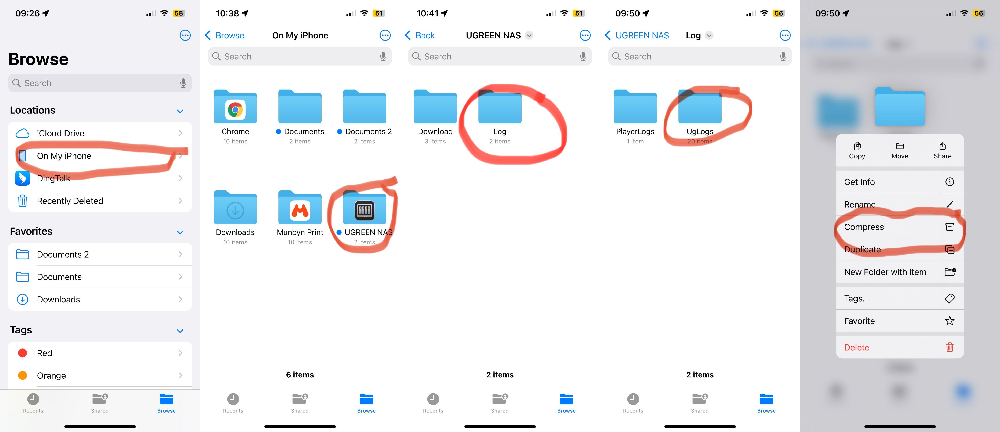
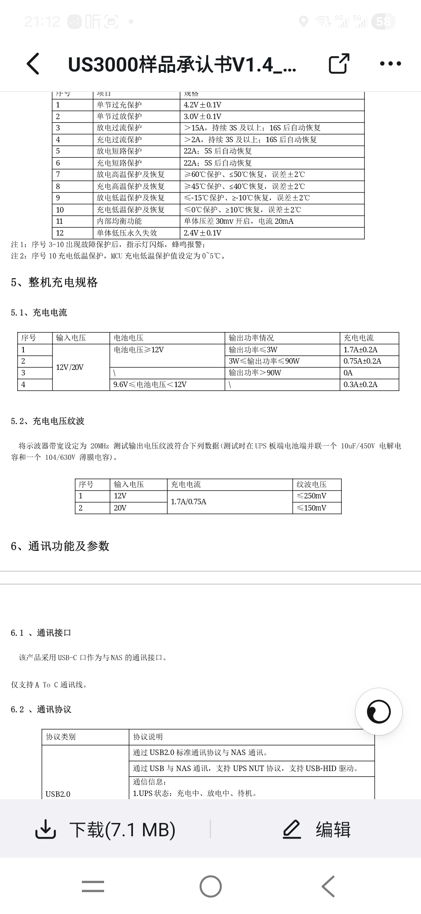
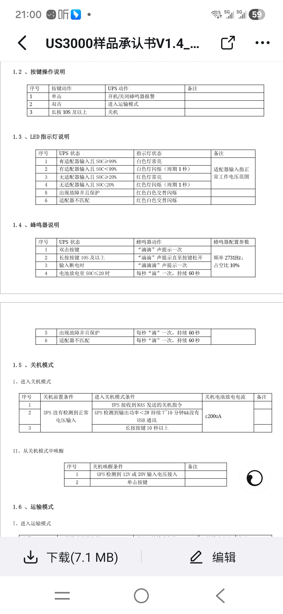

# Knowledge Center 28837d96416080cfa362efd350c1e1c1

# Knowledge Center

||[知识中心 (Main)](https://support.ugnas.com/knowledgecenter/#/know)|[知识中心 (带侧边栏)](https://support.ugnas.com/#/detail/eyJpZCI6NDMsInR5cGUiOiJ0YWcwMDEiLCJwYXRoQ29kZSI6InBybzAwMSx3b3RzMWoiLCJsYW5ndWFnZSI6ImVuLVVTIiwiY2xpZW50VHlwZSI6IlBDIiwiYXJ0aWNsZVZlcnNpb24iOiIifQ==)|||
| -| -| -----------| ------------------| -|
||[兼容性列表 (Compatibility List)](https://nas.ugreen.com/pages/compatibility)|[兼容性列表 (CN)](https://www.ugnas.com/compatible)|[固件手册](https://docspro.ugreengroup.com/projects/storage/存储管理器排障文档.html)|[SMB技术支持checklist](https://alidocs.dingtalk.com/spreadsheetv2/Lvm9kqG8uvGYnlOJ/edit?dentryKey=Lvm9kqG8uvGYnlOJ)|
|**重置**|[复位键功能](https://support.ugnas.com/knowledgecenter/#/detail/eyJpZCI6MTI1MSwidHlwZSI6InRhZzAwMiIsImxhbmd1YWdlIjoiemgtQ04iLCJjbGllbnRUeXBlIjoiUEMiLCJhcnRpY2xlSW5mb0lkIjo0MTYsImFydGljbGVWZXJzaW9uIjoiMS4wIiwicGF0aENvZGUiOiIifQ==)|[重置密码](https://support.ugnas.com/#/detail/eyJpZCI6ODgwLCJ0eXBlIjoidGFnMDAyIiwibGFuZ3VhZ2UiOiJ6aC1DTiIsImNsaWVudFR5cGUiOiJQQyIsImFydGljbGVJbmZvSWQiOjI5NCwiYXJ0aWNsZVZlcnNpb24iOiIiLCJwYXRoQ29kZSI6IiJ9)|[恢复出厂设置](https://support.ugnas.com/knowledgecenter/#/detail/eyJpZCI6OTg4LCJ0eXBlIjoidGFnMDAyIiwibGFuZ3VhZ2UiOiJqYS1KUCIsImNsaWVudFR5cGUiOiJQQyIsImFydGljbGVJbmZvSWQiOjMyNSwiYXJ0aWNsZVZlcnNpb24iOiIxLjAiLCJwYXRoQ29kZSI6IiJ9)|[恢复出厂 (via initrd)](https://ugreen-nas-public.s3.amazonaws.com/techSupport/1718676185590/UGREEN%20NAS%20Factory%20reset%20operation%20guide.pdf)|
|**存储**|[迁移内部存储硬盘](https://support.ugnas.com/#/detail/eyJpZCI6MTM3MiwidHlwZSI6InRhZzAwMiIsImxhbmd1YWdlIjoiemgtQ04iLCJjbGllbnRUeXBlIjoiUEMiLCJhcnRpY2xlSW5mb0lkIjo0NDQsImFydGljbGVWZXJzaW9uIjoiMS4wIiwicGF0aENvZGUiOiIifQ==) [YT](https://www.youtube.com/watch?v=_RFej8gIgFw)|[逐一更换硬盘扩容](https://support.ugnas.com/#/detail/eyJpZCI6MTQyLCJ0eXBlIjoidGFnMDAyIiwibGFuZ3VhZ2UiOiJ6aC1DTiIsImNsaWVudFR5cGUiOiJQQyIsImFydGljbGVJbmZvSWQiOjEzNCwiYXJ0aWNsZVZlcnNpb24iOiIiLCJwYXRoQ29kZSI6IiJ9)|[创建SSD缓存](https://support.ugnas.com/knowledgecenter/#/detail/eyJpZCI6MTI0MCwidHlwZSI6InRhZzAwMiIsImxhbmd1YWdlIjoiemgtQ04iLCJjbGllbnRUeXBlIjoiUEMiLCJhcnRpY2xlSW5mb0lkIjo0MTUsImFydGljbGVWZXJzaW9uIjoiMS4wIiwicGF0aENvZGUiOiIifQ==)||
|**客户端**|[Windows客户端白屏](https://support.ugnas.com/knowledgecenter/#/detail/eyJpZCI6Nzc2MywidHlwZSI6InRhZzAwMiIsImxhbmd1YWdlIjoiemgtQ04iLCJjbGllbnRUeXBlIjoiUEMiLCJhcnRpY2xlSW5mb0lkIjo3NTUsImFydGljbGVWZXJzaW9uIjoiMS4wIn0=)|[为什么手机照片不自动备份到相册](https://support.ugnas.com/#/detail/eyJpZCI6MjA0MCwidHlwZSI6InRhZzAwMiIsImxhbmd1YWdlIjoiemgtQ04iLCJjbGllbnRUeXBlIjoiTU9CSUxFIiwiYXJ0aWNsZUluZm9JZCI6NTU0LCJhcnRpY2xlVmVyc2lvbiI6IjEuMCIsInBhdGhDb2RlIjoiIn0=)|||
|**指南**|[iperf3](https://www.youtube.com/watch?v=cEKTA8nKqjE)|Tailscale: [Video](https://youtu.be/WSY7C3T1zTg)|挂载外部SMB到NAS: [Video](https://www.youtube.com/watch?v=eSsRGzhcBLU)|**SSH:**  [Windows](https://youtu.be/jkLi4CTD6cI)|
||**[How to disable watch dog in BIOS.pdf](https://naspro-public-eur.s3.eu-central-1.amazonaws.com/techSupport/1759325583846/How%20to%20disable%20watch%20dog%20in%20BIOS.pdf)**|[check drives in BIOS.pdf](https://naspro-public-eur.s3.eu-central-1.amazonaws.com/techSupport/1761214210811/check%20drives%20in%20BIOS.pdf)|[Network troubleshooting process](https://naspro-public-eur.s3.eu-central-1.amazonaws.com/techSupport/1761495951466/Network%20troubleshooting%20process_.pdf)|[备份还原Windows](https://support.ugnas.com/knowledgecenter/#/detail/eyJpZCI6MzczNywidHlwZSI6InRhZzAwMiIsImxhbmd1YWdlIjoiemgtQ04iLCJjbGllbnRUeXBlIjoiUEMiLCJhcnRpY2xlSW5mb0lkIjo2MzMsImFydGljbGVWZXJzaW9uIjoiMS4wIiwicGF0aENvZGUiOiIifQ==)|
||[同步与备份转圈](https://alidocs.dingtalk.com/document/edit?docKey=jP2lRYj14V013O8g&dentryKey=JPov3xzPiwl75M5k&type=d)||||

- **开机问题:**  **内存原装** | 网络橙闪 | 最小启动 | 接显示器 | 恢复出厂 | ＥＤＡＣ | 重置BIOS
- **硬盘问题:**  西数红盘 | 日志发来 | 完全重启 | 松动检查 | 反复拔插 | 换位思考 | SMART启动
- **网络问题:**  别无视灯 | 接路由器 | 旧事重提 | 完全重启 | 更换线口 | 路由后台 | ＩＰ　Ａ | 是跑马灯 | 获取失败

## 皮套

お世話になります。Ugreenテクニカルサポートチームです。

よろしくお願いします。

お客様

お世話になっております。UGREEN テクニカルサポートへお問い合わせいただき、誠にありがとうございます。

よろしくお願いします。

## 服务端日志

Collect a system diagnostic log: Support -> Contact Us -> Auxiliary Tools -> Generate System Diagnostic Information -> One-Click Generate. The system will generate a .tgz file, please send this file to us.

Collect a system diagnostic log: Support → Hilfe-Tools → Generierung mit einem Klick.
Das System erstellt anschließend eine .tgz-Datei – bitte senden Sie uns diese Datei.

お客様

お世話になっております。UGREEN テクニカルサポートへお問い合わせいただき、誠にありがとうございます。

原因をより正確に分析し、迅速に対応させていただくため、最新のNASデバイスログをご提供いただけますでしょうか。
UGREEN NASクライアントより以下の手順でログを作成いただけます：

「サポート」 → 「お問い合わせ」 → 「補助ツール」 → 「ワンクリックで作成」

生成された .tgz ファイルをこちらにお送りください。受領次第、詳細な原因調査を進めてまいります。

ご提供いただいた情報をもとに、詳細な原因調査と改善対応を進めてまいります。

お手数をおかけしますが、何卒ご協力のほどよろしくお願い申し上げます。

## 客户端日志

MacOS: `/Users/<your_user_name>/Library/UGREEN_Nas_Pro/log`

Windows: `C:\Users\<your_user_name>\AppData\Roaming\UGREEN_Nas_Pro\log`

Android:  [http://192.168.78.47:8900/decode/index.html#/main](http://192.168.78.47:8900/decode/index.html#/main) test Aa123456

iOS:  iOS App → Tap the profile icon in the top left corner → About → Log upload.



## 网络重置

If you forget the UGOS Pro administrator password on your UGREEN NAS and cannot log in, you can restore access by resetting the device. Please follow these steps:

Hold the "Reset" button on the back of the device for about 5 seconds and release it when you hear a beep. This will reset the following settings:

1. **Reset network settings and administrator password**

   The device will restore default network settings. Log in with the temporary admin account `admin` (password empty) and set a new secure password for the forgotten administrator account.
2. **Clear IP block list**

   All previously blocked IP addresses will be removed (Control Panel > Security > Block Management > Blocked IP List) to avoid access restrictions.
3. **Disable the firewall**

   The firewall will be disabled (Control Panel -> Security -> Firewall) to restore network access.
4. **Reset HTTP/HTTPS ports**

   The HTTP and HTTPS ports will be reset to defaults: HTTP 9999, HTTPS 9993. You can access the management page using these default ports.
5. **Clean large files (if EMMC storage is low)**

   If the device's EMMC storage is below 4GB, the system will automatically remove large non-system files (>100MB) stored on the EMMC. This does not affect system files but helps free space for proper operation.

⚠️ **Notes:**

- Holding for 13 seconds for a factory reset will clear all custom configurations but will not delete hard drive data.

## 刷机

- The system will need to be reinitialized and reconfigured
- Your storage pool and all personal/shared folder data will be preserved
- Installed apps and their data will be lost
- Virtual machines can be recovered via specific shell operation
- Docker containers and images can be recovered if Docker is reinstalled to the same storage pool
- If you are using memory modules not found on our compatibility list (**[https://nas.ugreen.com/pages/compatibility](https://www.google.com/url?sa=E&q=https://nas.ugreen.com/pages/compatibility)**), we strongly recommend switching back to the official RAM to prevent future file system corruption or unexpected reboots.
- The system will require reinitialization and reconfiguration, but your storage pool and all folder data will be preserved. After flashing, navigate to the Storage Manager, locate your drives, and select "Use" > "As internal storage." Your personal files will be moved to a shared folder named "User Folder."
- Previously installed applications and their data will be lost. If you have Docker containers or Virtual Machines and wish to preserve their data, do not reinstall these apps from the App Center immediately after flashing; instead, please contact us for command-line backup assistance first.

Dear Customer,

We have prepared a UGOS PRO installation image download link for you. Please note: this image is strictly limited to the device with the serial number EC671JJ09250693E and can only flash the firmware once. If you need to do it again, please contact us.

UGOS PRO flash image download link:

[https://api-aar.ugnas.com/api/system/v1/ua/temp/flashing/downloadUrl?id=785&sn=EC671JJ09250693E&urlId=320&tokenId=2062568330447409152](https://api-aar.ugnas.com/api/system/v1/ua/temp/flashing/downloadUrl?id=785&sn=EC671JJ09250693E&urlId=320&tokenId=2062568330447409152)

The detailed installation steps can be found in the attached PDF guide.

If you encounter any issues during the flashing process, please download the debug log after the error message appears via the following address:
`http://<nas_ip_address>:9999/ugreen/v1/upgrader/debug/log`
The downloaded log file will be a tar archive.

Kindly send the collected log files back to us.
Thank you for your understanding and support!

[UGOS Pro Firmware Flashing Guide.pdf](assets/UGOS_Pro_Firmware_Flashing_Guide-20260611101224-asq9du5.pdf)

[Anweisungen zum Flashen mit UGOS Pro.pdf](assets/Anweisungen_zum_Flashen_mit_UGOS_Pro-20260611101224-xd4yg81.pdf)

[UGOS Pro フラッシュ操作ガイド.pdf](UGOS_Pro_フラッシュ操作ガイド.pdf)

# 磁盘

## **震动**

Could you please record a short video (20–30 seconds) that clearly captures the humming noise and the vibration, and send it to us?

In addition, please refer to the attached guide and gently press each hard drive tray one by one to check whether the noise disappears when pressing a specific tray. This will help us identify if the vibration is related to the drive trays.

Thank you for your cooperation.


然后呢？USB1982837533809438720

## 西数红盘

[https://admin-us.ugnas.com/techSupport/tlcket?questionNo=USB1976749247844945920](https://admin-us.ugnas.com/techSupport/tlcket?questionNo=USB1976749247844945920)

Dear Customer,

Thank you for sending us the log file.

Recently, we’ve received similar reports from other users experiencing the same issue, and we are working closely with Western Digital’s engineering team to investigate this further. To assist in the analysis, could you please help us collect additional bin logs from both drives by following the steps below:

- Download the attached file and place it on your NAS device.
- Log in to your NAS via SSH. Guide: [https://www.youtube.com/watch?v=jkLi4CTD6cI](https://www.youtube.com/watch?v=jkLi4CTD6cI)
- And then run the following commands:

sudo -i

cd /home/<your username>/

unzip smrbin-1.22.1.0-x86_64.zip

cd ./smrbin-1.22.1.0-x86_64/opt/wdc/smrbin/bin
chmod 755 smrbin
./smrbin -l
./smrbin -d /dev/sda
./smrbin -d /dev/sdb
After the commands finish running, two seperate .bin files (e.g., xxxx.bin) will be generated in the same directory.
Please send those files back to us for further analysis.

Thank you very much for your cooperation and support,

Best regards,

Dear,

Thank you for your follow-up and for sharing the additional log details. Based on your description and the provided information, the new message does not indicate a physical bad sector on the drive.

This message usually appears when the SATA controller experiences a brief communication timeout or retry while reading from the drive, similar to the earlier “WRITE FPDMA QUEUED” warnings you observed. It is a protocol-level event, meaning the data transfer command between the controller and the disk was temporarily delayed but successfully recovered afterward.

Because both drives continue to operate normally, the storage pool remains healthy, and SMART reports show zero reallocated sectors or read errors, there is no evidence of physical media damage or data corruption.

Such transient I/O timeouts can occasionally occur during system startup or heavy I/O initialization, especially when the RAID array or drive interface is synchronizing. They are typically harmless as long as the disks stay connected and the pool status remains “Healthy.”

For ongoing monitoring, we recommend periodically performing a full SMART status test on each drive.
You can do this by going to:
Storage app → Hard Drive → HDD/SSD → click the “…” icon on the right side of each drive → Status Test → Extended Test.
Running this test occasionally helps confirm that both drives remain in good health.

If you ever notice recurring errors during normal operation, disk disconnections, or degraded RAID status, please export the latest system logs and share them with us for further analysis.

Thank you again for your patience, detailed feedback, and careful monitoring.

Hi there,

The error "WRITE FPDMA QUEUED" usually means there is a communication issue between the hard drive and the NAS controller, often related to SATA NCQ timing or signal stability on some high-capacity drives.

If you are comfortable making a technical adjustment, please follow these steps using SSH:

First, enable SSH on your NAS by going to Control Panel, then Terminal, and turning on the SSH service. You can follow the official guide here: [https://support.ugnas.com/knowledgecenter/#/detail/eyJjb2RlIjoiMiYmNDgxIn0=](https://support.ugnas.com/knowledgecenter/#/detail/eyJjb2RlIjoiMiYmNDgxIn0=)

When asked for your password, type it and press Enter. The password will not show on the screen while typing; this is normal.

After logging in, gain root access by typing

`sudo su -`

and entering your password again.

You will need to edit two files: `/boot/EFI/debian/grub.cfg` and `/boot/EFI/debian/grub.am`. Use the command

`nano /boot/EFI/debian/grub.cfg`

to open the first file. In nano, find the line starting with `linux /boot/` and add `libata.force=3.0Gbps` to the end of that line. For example, it should look like: `linux /boot/vmlinuz ... net.ifnames=0 biosdevname=0 libata.force=3.0Gbps`.

To save in nano, press Ctrl+O, then Enter. To exit, press Ctrl+X. Repeat the same steps for `/boot/EFI/debian/grub.am`.

After editing both files, restart your NAS.

This adjustment limits the SATA link speed to 3.0Gbps, which can improve signal stability for drives prone to NCQ errors without affecting normal HDD performance.

## 背板

[USB1988053715691565056](https://admin-us.ugnas.com/techSupport/tlcket?questionNo=USB1988053715691565056)

[USB1987966963152908288](https://admin-us.ugnas.com/techSupport/tlcket?questionNo=USB1987966963152908288)

SATA读不出可以重新插拔背板连接器。

## BTRFS

### 占用大量空间

快照、回收站、版本管理 OTB1981385557685628928 USB1981024447666450432

https://www.tapd.cn/tapd_fe/40685585/bug/detail/1140685585001162829

df -h

btrfs filesystem usage /volume1*

### 占用大量IO

OTB1982130532505669632

禁用快照，禁用配额

btrfs-transaction占用大量IO可能是文件夹启用了配额

echo 0 > /sys/fs/btrfs/<UUID>/qgroups/drop_subtree_threshold
可能用于让系统**立即释放相关资源**或**停止触发扫描**。UUID:blkid

btrfs quota disable /volumeX

### 文件历史版本删除

You can go into the File Version Explorer, either disable version management or adjust the number of retained versions, and clean up unnecessary old versions in the app.

### 清除文件系统

```jsx
sudo wipefs -a /dev/sda
sudo sgdisk -Z /dev/sda
sudo sgdisk -o /dev/sda

sudo wipefs -a /dev/sdb
sudo sgdisk -Z /dev/sdb
sudo sgdisk -o /dev/sdb
```

## 磁盘排障流程

- 了解PV VG LV结构
- 看日志：从syslog解压
  - 看关机：/sbin/blkdeactivate -u -l wholevg -m disablequeueing
  - storage_serv_ugvolume → lsblk info

## 硬盘休眠检查

Dear Customer,

Hello!

Please first set the Global Search app to exclude your HDD volumes, then log in to your NAS via SSH and follow these steps to monitor disk activity:

1️⃣ Install the tool:

apt install inotify-tools

2️⃣ Create a script file inotify.sh and paste the following content:

#!/bin/bash#

LOG_FILE="/var/log/disk_activity.log"

MONITOR_PATH="/volume1"

touch "$LOG_FILE"

chmod 644 "$LOG_FILE"

echo "=== Start monitoring disk activity: $(date '+%F %T') ===&quot; &gt;&gt; &quot;$LOG_FILE"

inotifywait -m -r "$MONITOR_PATH" --format "%T %e %w%f" --timefmt "%F %T" | while read line; do

log_entry="[$(date '+%F %T')]$line"

echo "$log_entry&quot; &gt;&gt; &quot;$LOG_FILE"

done

3️⃣ Make the script executable and run it in the background:

chmod 755 inotify.sh

./inotify.sh &

The script will continuously monitor /volume1 and log all access events to /var/log/disk_activity.log.

Once the HDD wakes up, please send us this log file for analysis.

SSH login tutorials:

Windows: https://youtu.be/jkLi4CTD6cI

macOS: https://youtu.be/9IGOlXzAUCM

Best regards,

UGREEN Support Team

SSD Cache

用户询问内容的中文翻译：这对你有帮助吗？（附截图）我该如何检查缓存是否被正确使用？我看了任务管理器，但不确定该看哪里？另外，我也看到了这个（附截图）。我发现 SSD 缓存刚装好时能跑 800 MB/s，但使用一段时间后速度就下降了，即使闲置两天也不会恢复。

---

Dear Customer,

Thank you for the screenshots. To monitor the activity, please open the **Task Manager** app, go to the **Resource Monitor** tab, and select **Disk**. Based on your screenshots, we can clearly see active read and write traffic on your SSDs, which confirms that the cache is functioning as intended.

Please understand that SSD Cache is primarily designed to improve **random read/write performance** (such as small files, databases, VM images, system indexing, and photo thumbnails). It helps reduce HDD seek latency and significantly improves system responsiveness in multi-user environments where multiple people are accessing "hot data" simultaneously.

However, SSD Cache has limited impact on **large sequential writes** (e.g., massive video files). While it provides a high-speed buffer initially, it cannot increase the maximum physical sequential bandwidth of your HDD array. Once the buffer is saturated or the system determines the task is a large sequential transfer, the speed will naturally drop to match the HDDs' write limit (typically 200–300MB/s). It is normal for the cache not to return to the initial 800MB/s for large files even after idling, as the system prioritizes overall responsiveness over sequential burst speeds.

Best regards,

# 网络

**Hi,**

**Thank you for reaching out. Could you please check the following:**

- **Check if the network indicator light on your NAS is orange and flashing. This means there is a problem with the network connection.**
- **Confirm that both the NAS and your device are connected to the same local network (for remote access, UGREENlink needs to be enabled).**
- **In local network, visit **​**[https://find.ugnas.com/](https://find.ugnas.com/)**​ ** to see if your NAS can be discovered.**
- **Try accessing your NAS directly using the IP address shown in your router’s control panel.**

**This will help us narrow down the cause of the issue.**

**Best regards,**​**UGREEN Support Team**

### 修改DNS

英语：


德语：


### PXE协商检测法

OTB1976210175456509952 Hi,

Please first check the network indicator LEDs on the back of your NAS. The left green LED should remain steadily on, while the right amber LED should blink when there is network activity. If both LEDs are off, it indicates that the physical connection is not established. In this case, please recheck the Ethernet cable and the port on your TP-Link switch, or try connecting the NAS directly to your router again.

Next, observe the LAN indicator light on the front panel of the NAS. A steady white light indicates a normal connection, an amber light suggests a link issue, and if the LED is off, it means there is no network connection detected. If the front LAN light remains off, please proceed to check the BIOS configuration.

To enter the BIOS, connect a monitor and keyboard to your NAS, then reboot the device and press Ctrl + F12 during startup. Navigate to Advanced → Network Stack Configuration, and make sure that both LAN BootROM and IPv4 PXE Support are enabled. After confirming, press F10, choose Save & Exit, and select Save Changes and Reset to restart the NAS.

After rebooting, observe whether the screen shows the message “Start PXE over IPv4 on MAC: …”. If this appears, it means the NAS network interface is active. If you do not see this PXE message and the LAN LEDs remain off, please go back to the BIOS, choose Restore Defaults, save and reboot again.

If PXE runs correctly but the NAS still does not connect to the network, wait until the system boots into UGOS PRO or UGOS, and check again if the LAN indicators (both front and rear) behave normally.

If the issue persists after completing all steps above, please take clear photos of the rear RJ45 port LEDs and front LAN indicator, capture a screenshot of the Network Stack Configuration screen in BIOS, and export the system logs via Support → Contact Us → Auxiliary Tools. Then send these materials to us for further analysis.

Currently, based on your description, the LAN indicator on the front panel is completely off, while the indicator lights on both sides of the RJ45 Ethernet port on the rear panel are still functioning normally.

Regarding the network issue you are experiencing, we recommend following the steps below for troubleshooting.

Please connect your device to a monitor, restart your device, hold down Ctrl and repeatedly press F2 to enter the BIOS. Navigate to the Advanced/Network Stack Configuration menu and ensure that both Lan BootROM and IPv4 PXE Support options are enabled. Once confirmed, select Save & Exit/Save Changes and Rest to save the changes and restart your device.

After that, restart the device again and hold down Ctrl and repeatedly press F12 to enter the UEFI PXE boot environment. During this process, check whether PXE boot is functioning properly, specifically whether the MAC address of the network card is displayed and whether the yellow indicator light on the NAS RJ45 port is flashing.

If PXE boot fails, please provide us with relevant details so that we can analyze the issue further. If PXE boot is functioning normally, select Save & Exit Restore Defaults to restore BIOS default settings and proceed with the next steps.

Once the device starts, it will enter the UGOS PRO environment. Please press and hold 13S to reconfigure the network system and check whether the network indicator light status is normal. If the network status is abnormal, please also provide us with feedback so that we can analyze and resolve the issue accordingly. If the network status is normal, please use the RESET button to reconfigure the network system and ensure stable operation.

We look forward to your response and appreciate your patience and support!


### 网络性能差

Hello,

Thank you for providing the update. To determine if there is a network hardware issue with your NAS, we recommend performing an **iperf3** test.

You can follow the main steps shown in this video (Youtube: cEKTA8nKqjE) or use the following procedure:

1. Install **iperf3** on your Mac.
2. Connect to your NAS via SSH. If the steps in the video are not clear, please refer to this guide: **[https://support.ugnas.com/knowledgecenter/#/detail/eyJjb2RlIjoiMiYmNDgxIn0\=](https://www.google.com/url?sa=E&q=https://support.ugnas.com/knowledgecenter/#/detail/eyJjb2RlIjoiMiYmNDgxIn0=)**
   - Use your administrator username and password for the connection.
   - Please note that the password will not be displayed on the screen as you type.
3. Once connected, run the following command: sudo systemctl start iperf3

After starting the service, run the iperf3 client on your Mac to complete the test and send us the results.

Best regards,

# 账户

## **NAS显示离线**

**We have tried accessing your UGREEN Link via both mobile and PC browsers, and it works successfully. To resolve the issue where your NAS shows offline in your cloud account, please follow these steps:**

- **Log in to **​**[web.ugnas.com](http://web.ugnas.com)**​ ** with your cloud account.**
- **Unbind your current NAS from the account.**
- **Go back to the NAS control panel and re-enable the UGREEN Link feature.**
- **Log in to your cloud account again and check if the NAS status shows online.**

**Following these steps should typically resolve the offline status issue in your cloud account.**

## 更换账户

**Please follow these steps to try switching the NAS binding to your new email account:**

- **Log in to web.ugnas.com using your old cloud account ().**
- **Once logged in, unbind your NAS device.**
- **On the NAS, go to Control Panel -&gt; Device Connection -&gt; Remote Access, and disable UGLink.**
- **Re-enable UGLink and log in with your new email ().**
- **Check if the NAS can now be successfully bound to the new email account.**

**This method allows you to attempt the switch without performing a factory reset.**

**Best regards.**

# 文件／备份与同步

**[同步与备份](https://app.notion.com/p/29137d964160809785cbf8788a0db1b0?pvs=21)**

## 清除旧的凭证

Please try clearing the old credentials and attempt again by opening the Windows Control Panel → Credential Manager. Under Windows Credentials, locate the NAS address (for example, \\NASName or \\192.168.x.x) and remove the related entries.

## 备份失败

- 用户文件夹被占用（如文件传输、docker挂载）

## 谷歌云配额

Hi ,

Thank you for reaching out.

According to our analysis, the error message “Google Drive channel is currently congested” is caused by Google Drive API quota limitations. When a large number of files are scanned and uploaded, the task may exceed Google’s per-minute request limit, resulting error.

To improve task stability, we recommend:

Ensuring the NAS is using a stable (preferably wired) network connection.

Reducing the number of Cloud Drive tasks running at the same time.

Trying the sync again after a few hours, as Google may temporarily throttle the connection.

Re-logging into your Google account or re-adding the Google Drive service.

Splitting large sync tasks into smaller ones and scheduling them at different times.

Running tasks during off-peak hours to avoid API congestion.

If the issue persists, please contact us again and we will be glad to assist further.

Thank you for your understanding.

NLB1992895947784269824

OTB1991478567895355392

# 系统

## 跑马灯

**Dear user,**​**Regarding the three lights flashing from left to right, this usually indicates that the device has not successfully started the UGOS PRO system. Please follow the steps below:**

**Power off the NAS completely.Connect the NAS to a monitor or TV via HDMI to view the startup screen.Power it on again and record the full startup process on a camera or phone.Send us the video for further analysis.**

- **Power off the NAS completely.**
- **Connect the NAS to a monitor or TV via HDMI to view the startup screen.**
- **Power it on again and record the full startup process on a camera or phone.**
- **Send us the video for further analysis.**

**Tip: Lights flashing from left to right indicate self-check or startup; if they continue to flash, the system has not booted normally.**

**Thank you for your cooperation. We will assist you promptly once we receive the information.**

## **降级**

**Thank you for your inquiry. Please follow the steps below to try and see if the downgrade is successful.**

**1. Download firmware from our official website:**

[https://nas.ugreen.com/pages/downloads](https://nas.ugreen.com/pages/downloads)

**2. Extract the **​**​`UGOSPRO_OTA_***-release.img`​**​ ** file from the downloaded package and upload it to a shared directory on your NAS.**

**3. Once the upload is complete, log in to the NAS management terminal via SSH.**

For detailed instructions, please refer to the official documentation:

[https://support.ugnas.com/knowledgecenter/#/detail/eyJpZCI6MTQ0MSwidHlwZSI6InRhZzAwMiIsImxhbmd1YWdlIjoiamEtSlAiLCJjbGllbnRUeXBlIjoiUEMiLCJhcnRpY2xlSW5mb0lkIjo0ODEsImFydGljbGVWZXJzaW9uIjoiMS4wIn0=](https://support.ugnas.com/knowledgecenter/#/detail/eyJpZCI6MTQ0MSwidHlwZSI6InRhZzAwMiIsImxhbmd1YWdlIjoiamEtSlAiLCJjbGllbnRUeXBlIjoiUEMiLCJhcnRpY2xlSW5mb0lkIjo0ODEsImFydGljbGVWZXJzaW9uIjoiMS4wIn0=)

**4. If you uploaded the firmware file to the **​**​`firmware`​**​ ** shared folder of Storage Pool 1, run the following command to manually downgrade the firmware:**

```bash
sudo ugospro-upgrade /volume1/firmware/UGOSPRO_OTA_***-release.img
```

**5. After the downgrade is complete, please check whether the NAS operates normally with all hard drives installed.**

## 加入域

- 确保 NAS DNS 指向域控制器 (DC) IP
- 验证域名和 DC 主机名是否可以解析 通过ping
- 检查时间同步
- 尝试使用以下格式加入域：YOURDOMAIN\administrator

https://www.tapd.cn/tapd_fe/40685585/bug/detail/1140685585001094251

Hello,

You can set the LDAP server “Enforce signing requirements” to “Disable” via the Group Policy Management Console (GPMC).

Please follow these steps:

Log in to your Windows Server 2025 Domain Controller.

Open Group Policy Management Console (GPMC).

Locate or create a GPO applicable to your domain controller and edit it.

Navigate to: Computer Configuration → Windows Settings → Security Settings → Local Policies → Security Options

Find “Domain controller: LDAP server signing requirements” and set it to Disable.

Save and apply the policy (run gpupdate /force or restart the server).

After completing these steps, your NAS should be able to join the domain successfully.

## BIOS

Hello,

When powering on from a shutdown state, hold down Ctrl and repeatedly press F2 to enter the BIOS.

When powering on from a shutdown state, hold down Ctrl and repeatedly press F12 to enter the boot menu.

If the menu contains options other than setup and debian, that should be the UGOS PRO flashing boot menu.

Select it to start the flashing process.

It is recommended to create the USB using Rufus, and if your keyboard has an FN key, press it together with the function key.

Best regards,

UGREEN Support Team

# 硬件

## 风扇

PTB1984010742062698496 nano /etc/default/dxp2800.conf

## 6800 功率

Based on the detailed specifications of the DXP6800 Pro (Intel i5-1235U, dual 10GbE ports) and the configuration with 6 × 16TB Seagate Exos X18 drives, here is the estimated power consumption for your power-backup system design:
Idle/Low Load State (HDDs in standby):
System unit (CPU, motherboard, dual 10GbE NICs): Approx. 20W - 25W.
6 × Exos X18 drives idle (approx. 5.3W each): Approx. 32W.
Total: Approx. 52W - 57W.
Normal Operating State (Typical R/W activity):
System load: Approx. 30W - 35W.
6 × drives operating (approx. 9.4W each): Approx. 56W.
Total: Approx. 86W - 91W.
Peak Load State (Startup/Full Load):
Hard drives require high current during spin-up; a single Exos X18 peaks at approx. 28W.
Peak for 6 drives at startup: Approx. 168W.
System full load and peripheral interfaces (e.g., TBT4/USB power): Approx. 50W - 60W.
Total Peak: Approx. 220W - 230W.
Recommendation:
The DXP6800 Pro is equipped with a 250W internal power supply. To ensure stability and sufficient battery runtime for your power-backup system (UPS), we recommend configuring the UPS with a rated capacity of at least 300W per unit to allow for adequate redundancy.

# 其他

## **Time Machine**

お世話になっております。UGREENテクニカルサポートでございます。

この度はお問い合わせいただき、誠にありがとうございます。

ここ数日、macOS Tahoe へのアップグレード後に Time Machine に接続できない事例が複数報告されております。

弊社にて他のお客様とリモート確認を行った結果、現時点では本現象は macOS の日本語、韓国語、ベトナム語環境に限定して発生しており、その他の言語環境では同様の問題は確認されておりません。

詳細な調査の結果、問題の主な原因は macOS がローカルの「.timemachine」ディレクトリ下でのファイル操作に失敗していることにあると判明いたしました。なお、このエラーは NAS 側から返されたものではなく、他社製 NAS や外付け USB ストレージをご利用の場合でも同様の現象が確認されております。

つきましては、大変お手数ですが Apple 社のサポートにお問い合わせいただき、解決策の有無をご確認いただくことを強くおすすめいたします。

なお、一時的な回避策として、Mac の言語環境を英語に切り替えることでバックアップを実行可能です。また、一部のお客様からは、英語環境でバックアップを行った後に再度日本語環境に戻すと正常に動作するとの報告もございます。ご希望の場合は、こちらの方法もお試しください。

※Time Machine 領域を削除せずに英語環境に切り替えてバックアップした場合、失敗する可能性がありますのでご注意ください。

上記操作でも問題が改善されない場合は、恐れ入りますが、エラー画面のスクリーンショットを弊社までお送りいただけますでしょうか。今後の調査の参考とさせていただきます。

ご不便をおかけし、誠に申し訳ございません。ご不明点やご不安な点がございましたら、いつでもご連絡ください。

> Hello,
>
> To help us better analyze the Time Machine backup issue, please perform the following steps on your Mac to collect the relevant logs:
>
> 1. Open the **Terminal** application.
> 2. Enter the following command and press Enter:
>
> ```
> log show --predicate 'subsystem == "com.apple.TimeMachine"' --info --last 24h > ~/Desktop/TM_Log.txt
>
> ```
>
> 1. After the command completes, a log file named **TM_Log.txt** will be created on your Desktop.
> 2. Please provide this log file to us so that we can further investigate the issue.

## **Time Machine 不会删除旧备份**

Dear User,

Hello! Time Machine does support automatically deleting old backups once the disk reaches its limit. However, the current “insufficient disk space” issue occurs because deleted files are first moved into the shared folder’s Recycle Bin, which still consumes quota space and prevents Time Machine from cleaning up properly.

Please first check whether the shared folder used for Time Machine backups has a Recycle Bin and confirm if it contains deleted files that are still taking up space.

If such data exists, please disable the Recycle Bin for this shared folder:

Log in to the NAS Control Panel.

Go to Control Panel -> File Sharing -> Shared Folders.

Locate the shared folder used for Time Machine and click Edit.

Disable the Enable Recycle Bin option and save.

After disabling the Recycle Bin, Time Machine will be able to automatically remove old backups and continue working properly.

Best regards,
UGREEN Support Team

## Mac App连不上

Mac under System Preferences → Security & Privacy → Local Network and see if UGREEN NAS is enabled.

[https://www.tapd.cn/tapd_fe/40685585/bug/detail/1140685585001133107](https://www.tapd.cn/tapd_fe/40685585/bug/detail/1140685585001133107)

## Mac 本地连接不生效

## 1️⃣ Safe Attempt: Reset Permissions (Low Risk)

1. Open **Terminal**.
2. Run the command:

   ```bash
   sudo tccutil reset All com.ugreen.pro.client

   ```
3. Restart your Mac.
4. Reopen **UGREEN NAS Pro / Launcher**.

   - If macOS prompts for **Local Network** access, select **Allow**.
5. If the prompt does not appear or the issue persists, it may be caused by a macOS system bug.

   - Contact **Apple Support** or wait for a future system update.

---

## 2️⃣ Full Reinstall of UGREEN NAS Pro (Clean Installation)

### Step 1: Quit the App

- Quit **UGREEN NAS Pro / Launcher**.
- Terminate related background processes using **Activity Monitor**.

### Step 2: Delete the Application

- Go to **Finder → Applications** and delete **UGREEN NAS Pro / Launcher**.

### Step 3: Remove Residual Preferences, Logs, and Configuration

- Open **Terminal** and execute:

  ```bash
  # Remove preference files
  rm -rf ~/Library/Preferences/com.ugreen.pro.client.plist

  # Remove app container and cache
  rm -rf ~/Library/Containers/com.ugreen.pro.client

  # Remove logs and user configuration
  rm -rf ~/Library/UGREEN_Nas_Pro

  # Remove application support files
  sudo rm -rf /Library/Application\ Support/UGREEN_NAS_Launcher
  rm -rf ~/Library/Application\ Support/UGREEN_Nas_Pro
  ```

### Step 4 (Optional): Reset Permissions Again

```bash
sudo tccutil reset All com.ugreen.pro.client
```

- Restart your Mac and ensure all residual caches are cleared.

### Step 5: Reinstall the Application

1. Download the latest **UGREEN NAS Pro / Launcher** installer from the official website.
2. During the first launch, allow **Local Network** access when prompted.

### Step 6: Verify Permissions

- Go to **System Settings → Privacy &amp; Security → Local Network**.
- Confirm that **UGREEN NAS Pro / Launcher** is enabled.

---

## 远程协助 [时区](https://www.timeanddate.com/worldclock/converter.html)

**[预约远程规范](https://app.notion.com/p/28d37d96416080fb820ccb0329215be8?pvs=21)**

您好，
非常感谢您的回复。
我们已确认远程会话安排在 10 月 16 日 10:00 MEZ。
如果 TeamViewer ID 或密码发生更改，请在会话开始前将最新信息发送给我们。非常感谢您的配合。 顺祝商祺

Dear Customer,

Thank you for your confirmation. We have scheduled the remote support session for April 29, 2026, at 7:30 PM PDT.

If you already have TeamViewer installed on your computer, you can use it directly. Otherwise, please download the **TeamViewer QuickSupport** software from the official TeamViewer website.

[https://www.teamviewer.com/en-us/solutions/use-cases/quicksupport/](https://www.teamviewer.com/en-us/solutions/use-cases/quicksupport/)

Please send us your TeamViewer ID and password shortly before the session begins so we can connect and assist you.

Thank you for your cooperation.

Best regards,
UGREEN NAS Technical Support

## iOS夜间备份

我们注意到，由于 iOS 的限制，您的 iOS 系统经常会终止某些应用。我们还了解到，iOS 设备不允许应用在后台运行。

最好禁用夜间备份，并避免通过在任务菜单中向上滑动来手动关闭应用程序以保持其处于活动状态。

## SMB

[SMB](https://app.notion.com/p/SMB-29037d964160805aa71cc94c8ac1b0b3?pvs=21)

## WoL

- 分别对比测试 DXP 4800 与 DXP 4800p 设备在相同网络环境下的 Wake-on-LAN（WOL）功能。
- 在 DXP 4800 设备中执行 systemctl suspend 或关机操作，尝试通过 WOL 唤醒设备。
- 检查 UGOS 系统设置中 WOL 确认已开启。
- 进入 BIOS 确认 WOL 功能确认已启用。
- 使用 ethtool 检查网卡是否支持 WOL 且 WOL 设置是否启用。
- 手动将 /sys/class/net/eth#/power/control 设置为 on。
- 已排除链路聚合（Link Aggregation）配置干扰。
- 发送 WOL 数据包时，观察 NAS 的网络接口 LED 是否变化，并制作一段短视频。

## 和缩略图有关的服务

thumb_serv index_serv search_serv

## 相册备份

- 提示系统资源已丢失的任务，指任务对应的手机相册的资源，已经被用户删除；
- 提示任务失败，请重试的任务，需要具体客户端日志才有分析原因。
- [JPB1987488593016561664](https://admin-aar.ugnas.com/techSupport/tlcket?questionNo=JPB1987488593016561664)
- **后台自动备份指引、逻辑优化** [https://www.tapd.cn/tapd_fe/40685585/story/detail/1140685585001019231](https://www.tapd.cn/tapd_fe/40685585/story/detail/1140685585001019231)

## NFS no_root_squash

[https://www.tapd.cn/tapd_fe/40685585/bug/detail/1140685585001133155](https://www.tapd.cn/tapd_fe/40685585/bug/detail/1140685585001133155)

## 欧洲UGLink域名

api-eur.ugnas.com

eur6.ug.link

api.ugnas.com

center.ugnas.com

[TAPD](https://app.notion.com/p/TAPD-29937d96416080df907eef13223fe60b?pvs=21)

## DH2300和Docker

Hello, thank you for your attention.

To ensure system stability, Docker is currently **not available** in the UGREEN NAS App Center on the DH2300 model.

If you still want to try it, you can manually download the Docker package for other DH series products from our official website and install it. Please note that doing so may involve **compatibility risks** and could cause unknown issues.

Some review videos showing Docker functionality were based on versions provided **to internal and review users during early testing**, for feature verification and performance testing, and have **not been officially released to all users**.

We are continuously optimizing compatibility and stability, and will evaluate whether to officially open Docker in the App Center based on test results.

Thank you for your understanding and support.

Hallo, vielen Dank für Ihre Aufmerksamkeit.

Um die Systemstabilität zu gewährleisten, ist Docker derzeit im **UGREEN NAS App Center für das DH2300-Modell nicht verfügbar**.

Wenn Sie es trotzdem ausprobieren möchten, können Sie das Docker-Paket für andere DH-Serienprodukte manuell von unserer offiziellen Webseite herunterladen und installieren. Bitte beachten Sie, dass dies **Kompatibilitätsrisiken** birgt und zu unbekannten Problemen führen kann.

Einige Testberichte und Videos, die Docker-Funktionen zeigen, basieren auf Versionen, die **internen und Testnutzern in der frühen Testphase** zur Verfügung gestellt wurden, um Funktionen und Leistung zu überprüfen, und **sind noch nicht offiziell für alle Nutzer freigegeben**.

Wir arbeiten kontinuierlich an der Optimierung von Kompatibilität und Stabilität und werden basierend auf den Testergebnissen prüfen, ob Docker offiziell im App Center verfügbar gemacht wird.

Vielen Dank für Ihr Verständnis und Ihre Unterstützung.

## ISCSI Windows 故障转移群集

[https://www.tapd.cn/tapd_fe/40685585/bug/detail/1140685585001127920](https://www.tapd.cn/tapd_fe/40685585/bug/detail/1140685585001127920)

## 1.7 虚拟机

*rm /volume1/@appstore/com.ugreen.kvm/config/usb.json*

## AD Join and LDAP Search

[https://admin-eur.ugnas.com/techSupport/tlcket?questionNo=DEB1987859330983997440](https://admin-eur.ugnas.com/techSupport/tlcket?questionNo=DEB1987859330983997440)

## 客户端

[ProApp_v1.10.0.19201_3167116ded_20251020-google-release.apk](https://drive.google.com/file/d/1rOJIcok6EC7UwZh4ENMFwLhHqbv9l2fy/view?usp=sharing)

## 密码

Hello,

Please note that the account for web.ugnas.com is different from your local NAS account. To log into the NAS management interface, you need to use the username and password created when initializing the device.
If you already set your email as username, since the local username cannot contain the "@" character, so please remove any "@" symbols from your email if you have been using it as the username, and then try logging in again. Also, pay attention to the capitalization of the username.

We also recommend performing a factory reset and creating a new username that does not contain any special characters. A factory reset will not erase any data on your hard drives, but you will need to reconfigure the system afterwards.

If you did not use an email as your username or have forgotten your username or password, please follow the instructions in the following link to reset your credentials:
[https://support.ugnas.com/#/detail/eyJpZCI6ODgwLCJ0eXBlIjoidGFnMDAyIiwibGFuZ3VhZ2UiOiJlbi1VUyIsImNsaWVudFR5cGUiOiJQQyIsImFydGljbGVJbmZvSWQiOjI5NCwiYXJ0aWNsZVZlcnNpb24iOiIiLCJwYXRoQ29kZSI6IiJ9](https://support.ugnas.com/#/detail/eyJpZCI6ODgwLCJ0eXBlIjoidGFnMDAyIiwibGFuZ3VhZ2UiOiJlbi1VUyIsImNsaWVudFR5cGUiOiJQQyIsImFydGljbGVJbmZvSWQiOjI5NCwiYXJ0aWNsZVZlcnNpb24iOiIiLCJwYXRoQ29kZSI6IiJ9)

For instructions on performing a factory reset, please refer to:
[https://support.ugnas.com/knowledgecenter/#/detail/eyJpZCI6OTg4LCJ0eXBlIjoidGFnMDAyIiwibGFuZ3VhZ2UiOiJlbi1VUyIsImNsaWVudFR5cGUiOiJQQyIsImFydGljbGVJbmZvSWQiOjMyNSwiYXJ0aWNsZVZlcnNpb24iOiIxLjAiLCJwYXRoQ29kZSI6IiJ9](https://support.ugnas.com/knowledgecenter/#/detail/eyJpZCI6OTg4LCJ0eXBlIjoidGFnMDAyIiwibGFuZ3VhZ2UiOiJlbi1VUyIsImNsaWVudFR5cGUiOiJQQyIsImFydGljbGVJbmZvSWQiOjMyNSwiYXJ0aWNsZVZlcnNpb24iOiIxLjAiLCJwYXRoQ29kZSI6IiJ9)

## macOS解压

macOS 26.0版本引入的兼容性问题，而且也跟macOS的系统语言有关：
1.macOS系统语言为中文时，复制zip文件到NAS解压，能成功解压，没有问题；
2.macOS系统语言为英文时，复制zip文件到NAS解压，解压失败，提示“The archive"xxx.zip" is empty or contains no readable items.”；
3.英文macOS系统再去解压中文macOS复制到NAS的文件，能解压成功；
4.中文macOS系统再去解压英文macOS复制到NAS的文件，解压失败；

所以问题取决于在macOS文件复制时是哪个语言，应该是英文版复制文件到NAS时添加了一些特殊的文件属性，导致macOS的archive utility解压时处理这些文件属性出现问题。
对于archive utility解压失败的文件，使用命令行工具unzip可以成功解压： unzip xxx.zip。
所以是macOS自带的archive utility解压工具才存在问题。

测试了群晖NAS，也存在一样的问题。
这个问题跟macOS 26的time machine多语言问题类似，我们无法了解macOS系统的内部处理逻辑是怎样的（网上没有相关资料，macOS的研发我们也接触不到），所以短时间内也无法确定要怎样修改samba来兼容它。

建议：建议客户使用其它的压缩软件（如unzip）来解压。

## App不可用

抱歉，您所提及的市场未在目前的上架范围内，客户端支持范围以官网为准。未来上架时间请留意官方动态，感谢您的关注。

## UPS




