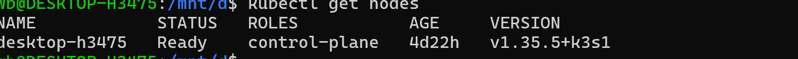
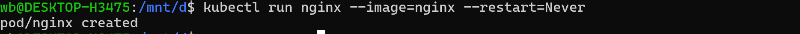
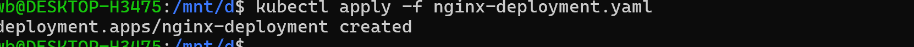
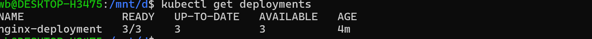
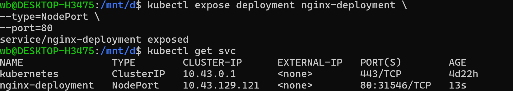
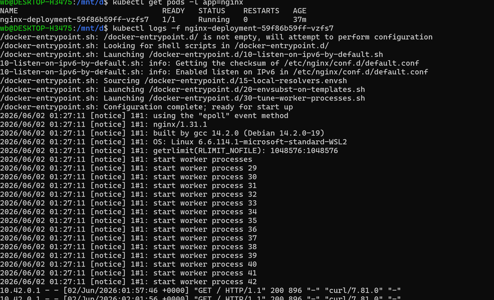

# kubernetes-cluster-setup-and-learning-guide

# kubernetes-cluster-setup-and-learning-guide

# K3s Kubernetes 集群部署配置与学习指南

> 生成日期: 2026-06-02
> 环境: WSL2 (Ubuntu 22.04 LTS) / K3s v1.35.5

---

## 目录

1. [集群概览](#1-集群概览)
2. [环境配置详情](#2-环境配置详情)
3. [集群架构](#3-集群架构)
4. [kubectl 配置与使用](#4-kubectl-配置与使用)
5. [日常运维命令](#5-日常运维命令)
6. [部署第一个应用](#6-部署第一个应用)
7. [Ingress 与对外暴露服务](#7-ingress-与对外暴露服务)
8. [存储与持久化](#8-存储与持久化)
9. [扩展组件](#9-扩展组件)
10. [Kubernetes 学习路线图](#10-kubernetes-学习路线图)
11. [常见问题与排查](#11-常见问题与排查)

---

## 1. 集群概览

Cluster
└─ Node
└─ Pod
└─ Container

当前集群为 **K3s** 单节点集群，运行在 WSL2 (Ubuntu 22.04) 之上。

|项目|说明|
| ------------| ------------------------|
|类型|单节点 (control-plane)|
|版本|Kubernetes v1.35.5 (K3s)|
|容器运行时|containerd 2.2.3|
|网络方案|Flannel (VXLAN)|
|Pod CIDR|10.42.0.0/24|
|Service CIDR|10.43.0.0/16|
|DNS 域名|cluster.local|
|节点内网 IP|172.21.140.96|

### 预装组件

|组件|镜像|用途|
| ----------------------| ---------------------------------------| ------------------------------|
|CoreDNS|rancher/mirrored-coredns-coredns:1.14.3|集群 DNS 解析|
|Traefik|rancher/mirrored-library-traefik:3.6.13|Ingress 控制器 / HTTP 反向代理|
|metrics-server|rancher/mirrored-metrics-server:v0.8.1|资源指标 (CPU/Memory)|
|local-path-provisioner|rancher/local-path-provisioner:v0.0.36|本地存储卷自动创建|
|svclb (klipper-lb)|rancher/klipper-lb:v0.4.17|内置 LoadBalancer|

---

## 2. 环境配置详情

### 系统信息

- **操作系统**: Ubuntu 22.04.5 LTS (Jammy Jellyfish)
- **内核**: 6.6.114.1-microsoft-standard-WSL2 (x86_64)
- **CPU**: 14 核 (Intel/AMD)
- **内存**: 15 GB 总内存 / 14 GB 可用
- **Swap**: 4 GB
- **Docker**: v29.5.2 (存储驱动: overlayfs, Cgroup: systemd)

### K3s 安装方式

K3s 通过官方安装脚本安装，以 systemd 服务运行：

```
服务文件: /etc/systemd/system/k3s.service
启动参数: k3s server (无额外参数)
```

### kubectl 配置

- **配置文件路径**: `~/.kube/config`
- **API Server**: `https://127.0.0.1:6443`
- **认证方式**: 客户端证书双向认证 (TLS)
- **默认上下文**: `default`

> kubectl 默认读取 `~/.kube/config`，无需额外配置环境变量即可使用。

### containerd 配置

- **Socket**: `/run/k3s/containerd/containerd.sock`
- **数据目录**: `/var/lib/rancher/k3s/agent/containerd`
- **stream 端口**: 10010
- **特性**: 非特权端口已启用, ICMP 已启用, SELinux 禁用

---

## 3. 集群架构

### 节点信息

```
NAME              STATUS   ROLES           AGE     VERSION
desktop-h3475     Ready    control-plane   4d22h   v1.35.5+k3s1
```

### 标签

- `kubernetes.io/arch=amd64`
- `kubernetes.io/os=linux`
- `node-role.kubernetes.io/control-plane=true`
- `node.kubernetes.io/instance-type=k3s`

### 网络拓扑

```ascii
┌────────────── WSL ───────────────┐
│                                   │
│   ┌────── K3s (v1.35.5) ───────┐ │
│   │   API Server :6443          │ │
│   │   ┌─────────────────────┐   │ │
│   │   │  Control Plane      │   │ │
│   │   │  - scheduler        │   │ │
│   │   │  - controller-mgr   │   │ │
│   │   └─────────────────────┘   │ │
│   │   ┌─────────────────────┐   │ │
│   │   │  Flannel (VXLAN)    │   │ │
│   │   │  Pod: 10.42.0.0/24  │   │ │
│   │   └─────────────────────┘   │ │
│   │   ┌─────────────────────┐   │ │
│   │   │  CoreDNS: 10.43.0.10│   │ │
│   │   └─────────────────────┘   │ │
│   │   ┌─────────────────────┐   │ │
│   │   │  Traefik LB         │   │ │
│   │   │  Port: 80, 443      │   │ │
│   │   └─────────────────────┘   │ │
│   └────────────────────────────── ┘ │
│     │  eth0: 172.21.140.96          │
│     │  docker0: 172.17.0.1          │
│     │  flannel.1: 10.42.0.0         │
│                                     │
│   ┌────── Docker ─────────────────┐ │
│   │  v29.5.2 / overlayfs         │ │
│   └──────────────────────────────┘ │
│                                     │
└─────────────────────────────────────┘
       │
 Windows (Windows Subsystem for Linux)
```

### 网络接口

|接口|IP|用途|
| ---------| ----------------| ---------------------|
|eth0|172.21.140.96/20|WSL 虚拟网卡 (主通信)|
|docker0|172.17.0.1/16|Docker 桥接网络|
|flannel.1|10.42.0.0|Flannel VXLAN 隧道|
|lo|127.0.0.1/8|本地回环|

### 命名空间

|Namespace|用途|
| ---------------| ---------------|
|default|默认, 用户应用|
|kube-system|系统组件|
|kube-public|公共资源|
|kube-node-lease|节点租约 (心跳)|

---

## 4. kubectl 配置与使用

### kubectl 自动补全

```bash
# Bash 补全（推荐）
source <(kubectl completion bash)
echo "source <(kubectl completion bash)" >> ~/.bashrc

# 设置 kubectl 别名（可选）
echo 'alias k=kubectl' >> ~/.bashrc
source ~/.bashrc

# 如果设置了别名，还可以启用别名补全
echo 'complete -o default -F __start_kubectl k' >> ~/.bashrc
```

### kubeconfig 文件结构

`~/.kube/config` 包含以下信息：

```yaml
apiVersion: v1
clusters:
- cluster:
    certificate-authority-data: <CA证书(base64)>
    server: https://127.0.0.1:6443
  name: default
contexts:
- context:
    cluster: default
    user: default
  name: default
current-context: default
kind: Config
users:
- name: default
  user:
    client-certificate-data: <客户端证书(base64)>
    client-key-data: <客户端私钥(base64)>
```

> 注意：k3s 的 kubeconfig 使用客户端证书认证，CA 和客户端证书都内嵌在文件中（base64 编码）。

### 多集群管理（可选）

```bash
# 查看当前上下文
kubectl config current-context

# 切换上下文（如果需要连接到其他集群）
kubectl config use-context <context-name>

# 查看完整配置
kubectl config view
```

---

## 5. 日常运维命令

### 节点管理

```bash
# 查看所有节点
kubectl get nodes
kubectl get nodes -o wide      # 详细信息
kubectl get nodes -o yaml      # YAML 格式输出

# 查看节点详情
kubectl describe node desktop-h3475

# 查看节点资源占用
kubectl top node
```

YAML（YAML Ain't Markup Language）是一种**人类可读的数据配置格式**，Kubernetes 的资源定义文件几乎都使用 YAML。

# Node 与 Pod 的关系

例如：

```
Node-1
 ├─ Pod-A
 ├─ Pod-B
 └─ Pod-C
```

每个 Pod 都必须运行在某个 Node 上。

‍

你可以把它理解成：

```
Linux 配置文件 + JSON 的简化版
```

### Pod 管理

```bash
# 查看 Pod
kubectl get pods                                     # 默认命名空间
kubectl get pods -A                                  # 所有命名空间
kubectl get pods -n kube-system                      # 指定命名空间
kubectl get pods -o wide                             # 显示 Pod IP 和节点
kubectl get pods --watch                             # 实时监控变化

# 查看 Pod 详情
kubectl describe pod <pod-name> -n <namespace>

# 查看 Pod 日志
kubectl logs <pod-name> -n <namespace>
kubectl logs -f <pod-name>                           # 实时跟踪日志
kubectl logs --tail=100 <pod-name>                   # 查看最后100行

# 进入 Pod 容器
kubectl exec -it <pod-name> -- /bin/sh               # sh shell
kubectl exec -it <pod-name> -- /bin/bash             # bash shell
kubectl exec -it <pod-name> -c <container-name> -- sh # 指定容器

# 查看 Pod 资源使用
kubectl top pod -A

# 删除 Pod
kubectl delete pod <pod-name>

```

### Deployment 管理

```bash
# 创建 Deployment
kubectl create deployment <name> --image=<image>

# 查看 Deployment
kubectl get deployments
kubectl get deployments -o wide
kubectl describe deployment <name>

# 扩缩容
kubectl scale deployment <name> --replicas=3

# 滚动更新
kubectl set image deployment/<name> <container>=<new-image>

# 回滚
kubectl rollout undo deployment/<name>
kubectl rollout status deployment/<name>

# 删除
kubectl delete deployment <name>
```

好，我们来梳理 **Pod** 和 **Container** 的关系，把 Kubernetes 的核心概念讲清楚，避免混淆。

---

# 1️⃣ Container（容器）

- 容器是最小的运行单位，里面运行一个应用进程。
- 有自己的文件系统、进程空间、网络接口，但通常共享宿主机内核。
- Docker 是最常用的容器运行时（K8s 也可以用 containerd、CRI-O）。

​**特点**：

|特性|描述|
| ------------| ------------------------------------------------------|
|独立进程|容器内运行一个或多个进程，但一般一个容器运行一个主进程|
|文件系统隔离|每个容器有自己的 root filesystem|
|网络隔离|默认有自己的 IP，但在 Pod 内可以共享|
|生命周期|容器挂掉就消失，需要 Pod 管理|

---

# Pod（Kubernetes 最小调度单元）

- Pod 是 Kubernetes ​**调度的最小单位**，里面可以包含一个或多个容器。
- Pod 内的容器共享：

  1. **网络命名空间** → 容器共享 IP 地址和端口
  2. **存储卷** → 容器共享挂载的卷
  3. **环境变量** → 可以通过 ConfigMap/Secret 注入
- Pod 可以理解为 ​**一个轻量级的容器组合**。

---

# Container 与 Pod 的关系

```text
Pod
 ├─ Container 1 (nginx)
 ├─ Container 2 (sidecar)
 └─ Container 3 (logging)
```

- ​**1:1 情况**（最常见）：一个 Pod 只运行一个容器，比如 nginx Pod。
- ​**1:n 情况**（高级用法）：Pod 内运行多个紧密耦合的容器，例如：

  - 主应用容器 + sidecar 日志收集器
  - 主应用容器 + 数据同步容器
- Pod 内的多个容器 ​**共享网络和卷**，方便协作。

---

# 4️⃣ 为什么 Pod 不直接用 Container

- Kubernetes 需要管理调度、扩缩容、健康检查等
- Pod 提供统一接口给 Scheduler → 可以保证容器被调度到合适节点
- Pod 生命周期比单个容器更灵活：

  - 副本管理（ReplicaSet / Deployment）
  - 自动重建
  - Service 负载均衡

---

# 5️⃣ 实例对比

### 例子：nginx Pod

```text
nginx-deployment-59f86b59ff-vzfs7
 └─ nginx (容器)
```

- Pod 名称：`nginx-deployment-59f86b59ff-vzfs7`
- Container 名称：`nginx`
- Service / kube-proxy 直接找到 Pod，然后转发流量到容器。

---

### 🔹 小结

|概念|描述|
| -------------------| -------------------------------------------|
|Container|运行应用的最小单元|
|Pod|Kubernetes 调度单元，可以包含一个或多个容器|
|Container 在 Pod 内|Pod 提供网络、卷、调度、生命周期管理|

‍

---

‍

### Service 管理

```bash
# 暴露服务
kubectl expose deployment <name> --port=80 --type=ClusterIP

# 查看 Service
kubectl get svc
kubectl get svc -A
kubectl describe svc <name>

# 端口转发（临时访问）
kubectl port-forward svc/<name> 8080:80
```

### 存储管理

```bash
# 查看 StorageClass
kubectl get sc

# 查看 PVC
kubectl get pvc
kubectl get pv

# 查看 PVC 详情
kubectl describe pvc <name>
```

### 配置管理

```bash
# ConfigMap
kubectl create configmap <name> --from-literal=key=value
kubectl create configmap <name> --from-file=config.yaml
kubectl get configmap
kubectl describe configmap <name>

# Secret
kubectl create secret generic <name> --from-literal=password=xxx
kubectl get secret
kubectl describe secret <name>
```

### 集群信息

```bash
# 集群基本信息
kubectl cluster-info

# 查看 API 版本
kubectl api-versions

# 查看所有 API 资源类型
kubectl api-resources
kubectl api-resources --namespaced=false  # 集群级别资源

# 查看集群事件
kubectl get events -A --sort-by='.lastTimestamp'
```

---

## 6. 部署第一个应用

### 示例 1: 使用命令行快速部署 Nginx

```bash
# 1. 创建 Deployment
kubectl create deployment nginx-demo --image=nginx:alpine

# 2. 暴露为 Service
kubectl expose deployment nginx-demo --port=80 --target-port=80 --type=ClusterIP

# 3. 验证
kubectl get pods -l app=nginx-demo
kubectl get svc nginx-demo

# 4. 测试访问（端口转发）
kubectl port-forward svc/nginx-demo 8080:80
# 打开浏览器访问 http://localhost:8080

# 5. 扩缩容测试
kubectl scale deployment nginx-demo --replicas=3
kubectl get pods -l app=nginx-demo

# 6. 清理
kubectl delete deployment nginx-demo
kubectl delete svc nginx-demo
```

### 示例 2: 使用 YAML 部署完整应用

以下是一个完整的 Deployment + Service YAML：

```yaml
# app.yaml
apiVersion: apps/v1
kind: Deployment
metadata:
  name: my-app
  labels:
    app: my-app
spec:
  replicas: 2
  selector:
    matchLabels:
      app: my-app
  template:
    metadata:
      labels:
        app: my-app
    spec:
      containers:
      - name: my-app
        image: nginx:alpine
        ports:
        - containerPort: 80
        resources:
          requests:
            cpu: "100m"
            memory: "64Mi"
          limits:
            cpu: "200m"
            memory: "128Mi"
---
apiVersion: v1
kind: Service
metadata:
  name: my-app-svc
spec:
  selector:
    app: my-app
  ports:
  - port: 80
    targetPort: 80
  type: ClusterIP
```

```bash
# 部署
kubectl apply -f app.yaml

# 查看
kubectl get deployments,svc,pods -l app=my-app

# 测试
kubectl port-forward svc/my-app-svc 8080:80

# 删除
kubectl delete -f app.yaml
```

### 示例 3: 部署 WordPress (有状态应用)

```yaml
# wordpress.yaml
---
apiVersion: v1
kind: PersistentVolumeClaim
metadata:
  name: mysql-pvc
spec:
  accessModes:
    - ReadWriteOnce
  resources:
    requests:
      storage: 5Gi
---
apiVersion: v1
kind: Secret
metadata:
  name: mysql-secret
type: Opaque
stringData:
  password: "my-secret-pw"
---
apiVersion: apps/v1
kind: Deployment
metadata:
  name: mysql
spec:
  selector:
    matchLabels:
      app: mysql
  template:
    metadata:
      labels:
        app: mysql
    spec:
      containers:
      - name: mysql
        image: mysql:8
        env:
        - name: MYSQL_ROOT_PASSWORD
          valueFrom:
            secretKeyRef:
              name: mysql-secret
              key: password
        - name: MYSQL_DATABASE
          value: wordpress
        ports:
        - containerPort: 3306
        volumeMounts:
        - name: data
          mountPath: /var/lib/mysql
        resources:
          requests:
            cpu: "200m"
            memory: "256Mi"
      volumes:
      - name: data
        persistentVolumeClaim:
          claimName: mysql-pvc
---
apiVersion: v1
kind: Service
metadata:
  name: mysql
spec:
  ports:
  - port: 3306
  selector:
    app: mysql
  clusterIP: None
---
apiVersion: apps/v1
kind: Deployment
metadata:
  name: wordpress
spec:
  selector:
    matchLabels:
      app: wordpress
  template:
    metadata:
      labels:
        app: wordpress
    spec:
      containers:
      - name: wordpress
        image: wordpress:latest
        env:
        - name: WORDPRESS_DB_HOST
          value: mysql
        - name: WORDPRESS_DB_USER
          value: root
        - name: WORDPRESS_DB_PASSWORD
          valueFrom:
            secretKeyRef:
              name: mysql-secret
              key: password
        - name: WORDPRESS_DB_NAME
          value: wordpress
        ports:
        - containerPort: 80
        resources:
          requests:
            cpu: "200m"
            memory: "128Mi"
---
apiVersion: v1
kind: Service
metadata:
  name: wordpress
spec:
  ports:
  - port: 80
  selector:
    app: wordpress
  type: NodePort
```

```bash
# 部署
kubectl apply -f wordpress.yaml

# 查看
kubectl get pods -l app=wordpress
kubectl get pods -l app=mysql
kubectl get svc wordpress

# 获取访问端口
kubectl get svc wordpress
# NodePort 通常在 30000-32767 之间, 例如 31154
# 通过 http://172.21.140.96:<NodePort> 访问
```

---

## 7. Ingress 与对外暴露服务

Traefik 是集群默认的 Ingress 控制器，运行在 80/443 端口。

### 查看当前 Ingress 信息

```bash
kubectl get ingressclass
# 输出: traefik   traefik.io/ingress-controller

# Traefik Service (LoadBalancer 类型)
kubectl get svc -n kube-system traefik
# 输出: traefik  LoadBalancer  10.43.188.17   172.21.140.96   80:31154/TCP,443:32453/TCP
```

> Traefik Service 的类型为 LoadBalancer，在单节点环境下通过 svclb (klipper-lb) 监听宿主机端口 80 和 443。

### Ingress 配置示例

以下 YAML 通过 Ingress 将域名 `myapp.local` 路由到上一步的 Service：

```yaml
# ingress.yaml
apiVersion: networking.k8s.io/v1
kind: Ingress
metadata:
  name: myapp-ingress
  annotations:
    traefik.ingress.kubernetes.io/router.entrypoints: web    # 使用 HTTP 入口
spec:
  ingressClassName: traefik
  rules:
  - host: myapp.local
    http:
      paths:
      - path: /
        pathType: Prefix
        backend:
          service:
            name: my-app-svc
            port:
              number: 80
```

```bash
# 应用 Ingress
kubectl apply -f ingress.yaml

# 查看 Ingress
kubectl get ingress

# 测试需要在 Windows hosts 文件添加解析
# C:\Windows\System32\drivers\etc\hosts 添加:
# 172.21.140.96  myapp.local

# 然后浏览器访问 http://myapp.local
```

### HTTPS (TLS) 配置

```yaml
# ingress-tls.yaml
apiVersion: networking.k8s.io/v1
kind: Ingress
metadata:
  name: myapp-ingress-tls
spec:
  ingressClassName: traefik
  tls:
  - hosts:
    - myapp.local
    secretName: myapp-tls-secret
  rules:
  - host: myapp.local
    http:
      paths:
      - path: /
        pathType: Prefix
        backend:
          service:
            name: my-app-svc
            port:
              number: 80
```

```bash
# 生成自签名证书
openssl req -x509 -nodes -days 365 \
  -newkey rsa:2048 -keyout tls.key -out tls.crt \
  -subj "/CN=myapp.local"

# 导入为 Secret
kubectl create secret tls myapp-tls-secret \
  --key tls.key --cert tls.crt

# 应用
kubectl apply -f ingress-tls.yaml
```

### Dashboard (Kubernetes 官方) 部署

```bash
# 部署 Kubernetes Dashboard
kubectl apply -f https://raw.githubusercontent.com/kubernetes/dashboard/v2.7.0/aio/deploy/recommended.yaml

# 创建管理员 Token
cat <<EOF | kubectl apply -f -
apiVersion: v1
kind: ServiceAccount
metadata:
  name: admin-user
  namespace: kubernetes-dashboard
---
apiVersion: rbac.authorization.k8s.io/v1
kind: ClusterRoleBinding
metadata:
  name: admin-user
roleRef:
  apiGroup: rbac.authorization.k8s.io
  kind: ClusterRole
  name: cluster-admin
subjects:
- kind: ServiceAccount
  name: admin-user
  namespace: kubernetes-dashboard
EOF

# 获取登录 Token
kubectl -n kubernetes-dashboard create token admin-user

# 启动代理
kubectl proxy

# 访问: http://localhost:8001/api/v1/namespaces/kubernetes-dashboard/services/https:kubernetes-dashboard:/proxy/
```

---

## 8. 存储与持久化

### 默认 StorageClass

集群通过 `local-path-provisioner` 提供本地存储，这是默认的 StorageClass：

```bash
kubectl get sc

# NAME                    PROVISIONER              RECLAIMPOLICY   VOLUMEBINDINGMODE
# local-path (default)    rancher.io/local-path    Delete          WaitForFirstConsumer
```

特点：

- **回收策略**: Delete（删除 PVC 时自动删除 PV 和底层数据）
- **绑定模式**: WaitForFirstConsumer（Pod 调度到节点后才创建卷，保证数据本地性）
- **数据位置**: `/var/lib/rancher/k3s/storage/`

### 使用示例

```yaml
# pvc-demo.yaml
apiVersion: v1
kind: PersistentVolumeClaim
metadata:
  name: demo-pvc
spec:
  accessModes:
    - ReadWriteOnce
  resources:
    requests:
      storage: 1Gi
---
apiVersion: apps/v1
kind: Deployment
metadata:
  name: pvc-demo
spec:
  replicas: 1
  selector:
    matchLabels:
      app: pvc-demo
  template:
    metadata:
      labels:
        app: pvc-demo
    spec:
      containers:
      - name: alpine
        image: alpine:latest
        command: ["/bin/sh", "-c", "while true; do echo $(date) >> /data/demo.txt; sleep 10; done"]
        volumeMounts:
        - name: data
          mountPath: /data
      volumes:
      - name: data
        persistentVolumeClaim:
          claimName: demo-pvc
```

### 注意事项

- **本地存储的限制**: 重启 WSL 后 Pod 可正常恢复，但数据路径基于宿主机
- **不适合多节点**: 单节点集群使用本地存储没有问题
- **生产建议**: 如需生产级持久化，建议加装 Longhorn 或 NFS

---

## 9. 扩展组件

### Helm 包管理器

```bash
# 安装 Helm
curl https://raw.githubusercontent.com/helm/helm/main/scripts/get-helm-3 | bash

# 验证
helm version

# 添加仓库
helm repo add bitnami https://charts.bitnami.com/bitnami
helm repo add prometheus-community https://prometheus-community.github.io/helm-charts
helm repo update

# 安装 Nginx Ingress（可选，已经内置 Traefik）
# helm install nginx-ingress ingress-nginx/ingress-nginx
```

### Prometheus + Grafana 监控

```bash
# 添加仓库
helm repo add prometheus-community https://prometheus-community.github.io/helm-charts
helm repo update

# 安装 kube-prometheus-stack
helm install prometheus prometheus-community/kube-prometheus-stack \
  --namespace monitoring --create-namespace

# 查看
kubectl get pods -n monitoring

# 访问 Grafana
kubectl port-forward -n monitoring svc/prometheus-grafana 3000:80

# 默认用户名密码: admin / prom-operator
```

### Longhorn (分布式存储)

```bash
# 安装 Longhorn
kubectl apply -f https://raw.githubusercontent.com/longhorn/longhorn/master/deploy/longhorn.yaml

# 查看
kubectl get pods -n longhorn-system

# 访问 UI
kubectl port-forward -n longhorn-system svc/longhorn-frontend 8080:80
```

### Ingress NGINX Controller

```bash
# 如果需要 NGINX 而不是 Traefik
helm install ingress-nginx ingress-nginx/ingress-nginx \
  --repo https://kubernetes.github.io/ingress-nginx \
  --namespace ingress-nginx --create-namespace
```

---

## 10. Kubernetes 学习路线图

### 第一阶段: 基础入门 (1-2 周)

**目标**: 理解核心概念，能部署简单的无状态应用

**学习内容**:

```
[Kubernetes 核心概念]
├── Pod               → 最小的部署单元（一组容器）
├── Deployment        → 声明式管理 Pod 的副本和更新
├── Service           → 网络抽象，提供稳定的访问入口
│   ├── ClusterIP     → 集群内部访问
│   ├── NodePort      → 外部通过节点 IP + 端口访问
│   └── LoadBalancer  → 外部通过负载均衡器访问
├── Namespace         → 资源隔离和分组
├── ConfigMap/Secret  → 配置和敏感数据管理
└── kubectl           → 命令行管理工具
```

**实战练习**:

1. 运行 `kubectl get pods -A` 查看集群组件

   

   ‍
2. 用 `kubectl run` 部署一个 nginx Pod

   

   |参数|说明|
   | ----| -------------------------------------------------------|
   |​`nginx`|Pod 的名字|
   |​`--image=nginx`|使用的镜像，这里是官方 nginx|
   |​`--restart=Never`|直接创建 Pod，而不是 Deployment（只适合学习和临时测试）|

   ‍
3. 编写第一个 Deployment YAML 并部署

   在本地新建文件：`nginx-deployment.yaml`

   内容如下：

   ```
   apiVersion: apps/v1
   kind: Deployment
   metadata:
     name: nginx-deployment   # Deployment 名称
     labels:
       app: nginx
   spec:
     replicas: 3              # 副本数
     selector:
       matchLabels:
         app: nginx           # 匹配 Pod 的标签
     template:
       metadata:
         labels:
           app: nginx
       spec:
         containers:
           - name: nginx
             image: nginx:latest
             ports:
               - containerPort: 80
   ```

   ✅ 解释：

   - ​`replicas: 3` → K8s 会保持 3 个 Pod 同时运行
   - ​`selector.matchLabels` → Deployment 会管理带这个标签的 Pod
   - ​`template` → Pod 的模板
   - ​`containers` → Pod 内的容器列表
   - ​`containerPort: 80` → 容器对外端口

   部署 Deployment

   

   kubectl get deployments

   

   ‍
4. 创建 Service 暴露应用

   这是 Kubernetes 最基础也最重要的操作之一。

   前面你已经创建了 Deployment：

   ```
   kubectl apply -f nginx-deployment.yaml
   ```

   现在 Deployment 创建了 Pod，但外部无法直接访问，因为 Pod IP 会变化，所以需要创建 Service。

   4.1命令行直接创立

   

   4.2 编写 service yaml文件

   apiVersion: v1
   kind: Service

   metadata:
   name: nginx-service

   spec:
   type: NodePort

   <div>
   <span data-type="text" style="background-color: var(--b3-font-background9);">  selector:</span>  
       app: nginx
   </div>

   ports:
   - <span data-type="text" style="background-color: var(--b3-font-background3);">port</span>: 80
   t<span data-type="text" style="background-color: var(--b3-font-background12);">argetPort</span>: 80
   <span data-type="text" style="background-color: var(--b3-font-background4);">nodePort</span>: 30080

   ‍

   ‍

   ‍

   关键参数解释：

   ‍

   <div>
   <span data-type="text" style="background-color: var(--b3-font-background9);">selector:</span>
   </div>

   ```
   selector:
     app: nginx
   ```

   匹配：

   ```
   labels:
     app: nginx
   ```

   的 Pod。

   ‍

   ‍

   <div>
   <span data-type="text" style="background-color: var(--b3-font-background3);">port</span>
   </div>

   ```
   port: 80
   ```

   Service 内部端口。

   ‍

   ‍

   t<span data-type="text" style="background-color: var(--b3-font-background12);">argetPort</span>:

   ```
   targetPort: 80
   ```

   转发到 Pod 的 80 端口。

   ‍

   ‍

   <span data-type="text" style="background-color: var(--b3-font-background4);">nodePort</span>:

   ```
   nodePort: 30080
   ```

   外部访问端口。

   ‍
5. 练习 `kubectl scale` 扩缩容

   ## 扩容 Deployment 到 6 个副本

   ```
   kubectl scale deployment nginx-deployment --replicas=6
   ```

   确认 Deployment 扩容：

   ```
   kubectl get deployments
   ```

   输出示例：

   ```
   NAME               READY   UP-TO-DATE   AVAILABLE   AGE
   nginx-deployment   6/6     6            6           40m
   ```

   查看 Pod：

   ```
   kubectl get pods -o wide
   ```

   输出示例：

   ```
   NAME                                READY   STATUS    RESTARTS   AGE     IP
   nginx-deployment-59f86b59ff-nf87n   1/1     Running   0          40m     10.42.0.48
   nginx-deployment-59f86b59ff-qg9ps   1/1     Running   0          40m     10.42.0.49
   nginx-deployment-59f86b59ff-vzfs7   1/1     Running   0          40m     10.42.0.50
   nginx-deployment-59f86b59ff-abcde   1/1     Running   0          1m      10.42.0.51
   nginx-deployment-59f86b59ff-fghij   1/1     Running   0          1m      10.42.0.52
   nginx-deployment-59f86b59ff-klmno   1/1     Running   0          1m      10.42.0.53
   ```

   - 新增 3 个 Pod
   - IP 和 Pod 名称会自动生成

   查看 Service Endpoints：

   ```
   kubectl get endpoints nginx-service
   ```

   输出示例：

   ```
   NAME            ENDPOINTS
   nginx-service   10.42.0.48:80,10.42.0.49:80,10.42.0.50:80,10.42.0.51:80,10.42.0.52:80,10.42.0.53:80
   ```

   ✅ Service 已经识别新 Pod，负载均衡池更新完毕。

   ---

   ## 2️⃣ 缩容 Deployment 到 1 个副本

   ```
   kubectl scale deployment nginx-deployment --replicas=1
   ```

   查看 Pod：

   ```
   kubectl get pods -o wide
   ```

   输出示例：

   ```
   NAME                                READY   STATUS    RESTARTS   AGE     IP
   nginx-deployment-59f86b59ff-nf87n   1/1     Running   0          40m     10.42.0.48
   ```

   - 多余 Pod 会被自动删除
   - Endpoints 更新：

   ```
   kubectl get endpoints nginx-service
   ```

   输出示例：

   ```
   NAME            ENDPOINTS
   nginx-service   10.42.0.48:80
   ```

   ✅ Service 现在只指向存活的 Pod。
6. 查看 Pod 日志 (`kubectl logs`)

   pod的负载均衡

   # 基本原理

   在 Kubernetes 中，Pod 本身 ​**没有暴露 IP 给外部**​，外部访问需要通过 ​**Service**。

   Service 起到两个作用：

   1. ​**抽象 Pod 集合**（通过 label selector 选择 Pod）
   2. ​**负载均衡请求**（把访问请求分发到选中的 Pod 上）

   所以严格来说，负载均衡不是 Pod 自带的，而是 **Service + kube-proxy** 完成的。

   ---

   # 2️⃣ Service 负载均衡的流程

   假设有 Deployment：

   ```
   nginx-deployment
    └─ Pod1 (10.42.0.48)
    └─ Pod2 (10.42.0.49)
    └─ Pod3 (10.42.0.50)
   ```

   创建 Service：

   ```
   apiVersion: v1
   kind: Service
   metadata:
     name: nginx-service
   spec:
     selector:
       app: nginx
     type: ClusterIP
     ports:
       - port: 80
         targetPort: 80
   ```

   ---

   ## 流量走向

   ```
   Client (curl / Browser)
           │
           ▼
   nginx-service (ClusterIP)
           │
      kube-proxy
           │
      -----------------
      │       │       │
   Pod1    Pod2     Pod3
   ```

   - kube-proxy 会维护 iptables 或 ipvs 规则
   - 规则轮询（Round Robin）或者基于哈希（IP Hash）分发请求
   - Pod 数量变动，Endpoints 会自动更新，Service 会自动分发到新 Pod

   ---

   # 3️⃣ 在单副本 vs 多副本下的区别

   ### 单副本 Pod

   ```
   nginx-deployment-59f86b59ff-vzfs7
   ```

   - 所有请求都打到同一个 Pod
   - 日志里只会看到这个 Pod 的访问记录

   ### 多副本 Pod

   ```
   nginx-deployment-59f86b59ff-nf87n
   nginx-deployment-59f86b59ff-qg9ps
   nginx-deployment-59f86b59ff-vzfs7
   ```

   - Service 会把请求分散到不同 Pod
   - 日志会在不同 Pod 里出现访问记录
   - 这就是 **Pod 的负载均衡效果**

   
7. 进入容器 (`kubectl exec`)

**推荐资源**:

- [Kubernetes 官方教程](https://kubernetes.io/docs/tutorials/)
- [Play with Kubernetes](https://labs.play-with-k8s.com/) (在线不用安装)
- 📘 《Kubernetes in Action》第 1-5 章

---

## 1️⃣ Service 是如何找到 Pod 的？

Kubernetes Service ​**不会直接管理 Pod**​，它通过 **标签（Label）选择器（Selector）**   找到 Pod。

流程：

1. Service 配置了 selector，例如：

```yaml
selector:
  app: nginx
```

2. K8s 控制平面（kube-proxy + Endpoints Controller）会实时监控集群里 Pod 的标签。
3. 所有符合 selector 的 Pod 都会被添加到 ​**Endpoints 列表**：

```text
Endpoints: 10.42.0.48:80,10.42.0.49:80,10.42.0.50:80
```

4. 当客户端访问 Service IP 或 NodePort 时，kube-proxy 会根据 Endpoints 转发流量到对应 Pod。

> 简单理解：Service \= 流量入口，Selector + Endpoints \= 流量路由表。

---

## 2️⃣ 为什么 selector 必须和 Pod label 对应？

- Selector 是 Service 识别 Pod 的 ​**唯一条件**。
- 如果标签不匹配，Service 根本找不到 Pod，流量就无法转发。

例子：

```text
Service selector: app=nginx
Pod label: run=nginx
```

- 不匹配 → Pod 不会出现在 Endpoints 中 → 无法被访问

所以，Deployment 创建 Pod 时，标签一定要和 Service selector 对应：

```yaml
labels:
  app: nginx
```

---

## 3️⃣ 删除一个 Pod 后为什么访问不中断？

这是 Kubernetes **高可用机制**的体现：

1. Deployment 设置了 `replicas: 3`，保证始终有 3 个 Pod 运行。
2. 删除一个 Pod：

```bash
kubectl delete pod <pod-name>
```

3. Deployment 控制器检测到副本不足，会自动创建一个新的 Pod。
4. Service 的 Endpoints Controller 会更新列表，移除被删除的 Pod，加入新 Pod。

所以：

- Service 访问总是通过 Endpoints 列表
- 流量只会发送到 **健康 Pod**
- 用户访问几乎无感知 → 高可用

---

## 4️⃣ 一个 Service 能否同时代理多个 Pod？

✅ 完全可以，这正是 Service 的主要作用。

- 一个 Service 可以匹配 ​**任意数量的 Pod**，形成负载均衡池。
- 流量会按轮询（默认 kube-proxy iptables 模式）、或者其他调度策略转发给 Pod。
- 例如你的 nginx Deployment：

```text
Endpoints: 10.42.0.48:80,10.42.0.49:80,10.42.0.50:80
```

- Service 会同时代理 3 个 Pod
- 用户请求会被均衡分发到这 3 个 Pod

---

### 🔹 总结（核心概念）

## NodePort 与 ClusterIP 的区别

- ​**ClusterIP**：只能在集群内部访问（比如从 WSL 内访问 Pod）
- ​**NodePort**​：可以从集群外访问（通过宿主机 IP + NodePort，例如 `http://<WSL宿主机IP>:30080`）

|问题|核心解释|
| ---------------------------------------| -----------------------------------------------------------------------|
|Service 是如何找到 Pod 的？|通过`selector`标签匹配 Pod，并维护 Endpoints 列表|
|为什么 selector 必须和 Pod label 对应？|不匹配就找不到 Pod，流量无法转发|
|删除一个 Pod 后为什么访问不中断？|Deployment 自动补 Pod，Endpoints 列表实时更新，Service 只发送到健康 Pod|
|一个 Service 能否同时代理多个 Pod？|可以，Service 会负载均衡到所有匹配 Pod 的 Endpoints|

---

### 第二阶段: 进阶概念 (2-4 周)

**目标**: 掌握有状态应用、存储、网络和配置管理

**学习内容**:

```
[进阶概念]
├── StatefulSet       → 有状态应用（数据库等）
├── Volume & PVC/PV   → 存储持久化
│   ├── emptyDir      → 临时存储
│   ├── hostPath      → 宿主机路径
│   └── PVC           → 声明式存储
├── Ingress           → HTTP/HTTPS 路由到 Service
├── ConfigMap / Secret → 配置注入
├── Resource Quota    → 资源限制和配额
├── HPA (Horizontal Pod Autoscaler) → 自动扩缩容
├── NetworkPolicy     → 网络访问控制
└── RBAC              → 权限控制
```

**实战练习**:

1. 部署 WordPress + MySQL (StatefulSet + PVC)
2. 配置 Ingress 通过域名访问
3. 设置资源 Requests/Limits
4. 创建 ConfigMap 和 Secret 并注入 Pod
5. 配置 HPA 自动扩缩容
6. 设置 ResourceQuota 限制命名空间资源

**推荐资源**:

- [Kubernetes 官方文档 - Concepts](https://kubernetes.io/docs/concepts/)
- 《Kubernetes in Action》第 6-12 章
- [Kubernetes 互动教程 (Katacoda)](https://www.katacoda.com/courses/kubernetes)

---

### 第三阶段: 深入原理 (1-2 个月)

**目标**: 理解 Kubernetes 内部工作原理

**学习内容**:

```
[Kubernetes 架构]
├── etcd             → 集群数据存储 (分布式 KV 数据库)
├── kube-apiserver   → 所有请求的入口（REST API）
├── kube-scheduler   → Pod 调度决策
├── kube-controller-manager → 控制器集合
│   ├── Deployment Controller
│   ├── ReplicaSet Controller
│   ├── Node Controller
│   └── ...更多控制器
├── kubelet          → 节点上的 Agent
├── kube-proxy       → 网络代理 (iptables/IPVS)
├── Container Runtime → 容器运行时 (containerd/CRI-O)
└── CNI 插件         → 容器网络 (Flannel/Calico/Cilium)
```

**核心机制**:

|机制|说明|
| ----------------------| -------------------------------------------------|
|声明式 API|提交期望状态，控制器不断调谐至实际状态 = 期望状态|
|Watch 机制|各组件监听 API Server 变化，事件驱动|
|控制器循环 (Reconcile)|核心设计模式: 观察 → 分析 → 行动|
|调度算法|过滤 (Predicates) → 打分 (Priorities) 两阶段|
|DNS 解析|CoreDNS 为 Service 提供域名解析|
|Service 发现|kube-proxy 维护 iptables/IPVS 规则|

**实战练习**:

1. 用 `kubectl proxy` 直接调用 Kubernetes API
2. 使用 `etcdctl` 查看 etcd 中存储的集群数据
3. 编写一个自定义 CRD (Custom Resource Definition)
4. 编写一个简单的 Operator (使用 kubebuilder)
5. 测试 NetworkPolicy 实现网络隔离

**推荐资源**:

- [Kubernetes: The Hard Way](https://github.com/kelseyhightower/kubernetes-the-hard-way) (从零手动部署集群)
- 📕 《Kubernetes 源码剖析》
- [Kubernetes 设计文档](https://github.com/kubernetes/design-proposals-archive)
- [etcd 官网](https://etcd.io/docs/)

---

### 第四阶段: 生产化实战 (2-3 个月)

**目标**: 掌握生产级集群运维、安全、监控和 CI/CD

**学习内容**:

```
[生产化实战]
├── 集群部署           → kubeadm / K3s / RKE2 / EKS / AKS / GKE
├── 高可用             → 多控制平面、etcd 集群、Pod 反亲和
├── 监控告警           → Prometheus + Grafana + Alertmanager
├── 日志收集           → Loki / Elasticsearch + Fluentd
├── CI/CD              → GitOps (ArgoCD / Flux)
│   ├── Helm           → Kubernetes 包管理
│   └── Kustomize      → 原生 YAML 管理
├── 安全               →
│   ├── Pod Security Standards
│   ├── OPA/Gatekeeper → 策略引擎
│   ├── Falco          → 运行时安全
│   └── Service Mesh   → Istio / Linkerd
├── 服务网格           → Istio / Linkerd (灰度发布、流量管理)
├── 备份与恢复         → Velero
└── 成本管理           → Kubecost / KRR
```

**推荐认证**:

|认证|说明|难度|
| -------------------------------------------------| --------------------| --------|
|CKA (Certified Kubernetes Administrator)|管理员认证，实操考试|⭐⭐⭐|
|CKAD (Certified Kubernetes Application Developer)|开发者认证|⭐⭐|
|CKS (Certified Kubernetes Security Specialist)|安全专家认证|⭐⭐⭐⭐|

**学习平台**:

- [Killer Shell](https://killer.sh/) (CKA/CKAD 模拟环境)
- [A Cloud Guru](https://acloudguru.com/)
- [KodeKloud](https://kodekloud.com/)
- [Kubernetes 官网博客](https://kubernetes.io/blog/)

---

### 第五阶段: 生态系统与前沿 (长期)

**目标**: 熟悉云原生生态，了解前沿方向

**生态全景** (CNCF Landscape):

```
[云原生生态系统]
├── 调度与编排     → Kubernetes (核心)
├── 服务发现       → CoreDNS, etcd
├── 网关与入口     → Traefik, Envoy, Kong
├── 服务网格       → Istio, Linkerd, Consul Connect
├── 可观测性       → Prometheus, Grafana, OpenTelemetry
├── 日志           → Loki, Elasticsearch, Fluentd
├── 存储           → Longhorn, Rook/Ceph, MinIO
├── CI/CD          → ArgoCD, Flux, Tekton
├── Serverless     → Knative, OpenFaaS, KEDA
├── 消息队列       → Kafka, NATS, RabbitMQ
├── 包管理         → Helm, Kustomize
├── 策略与安全     → OPA, Kyverno, Falco, Tetragon
├── 边缘计算       → K3s, KubeEdge
└── AI/ML         → Kubeflow, Ray
```

**前沿方向**:

- **eBPF**: Cilium 网络 + 可观测性
- **Wasm**: WebAssembly 替代容器
- **FinOps**: 云原生成本优化
- **平台工程**: Backstage + Crossplane
- **AI 运维**: AIOps, Kubernetes + LLM

---

### 学习建议与资源汇总

#### 按角色推荐

|角色|重点学习内容|推荐认证|
| ----| ---------------------------------------------| ----------|
|**开发人员**|Deployment, Service, ConfigMap, Ingress, Helm|CKAD|
|**运维人员**|集群部署、监控、存储、网络、安全、备份|CKA → CKS|
|**架构师**|整个生态、高可用设计、多集群管理、服务网格|CKA + CKS|

#### 最佳实践

1. **动手 **​ **&gt;**​ ** 看书**: 每个概念学完立即在集群上实操
2. **从 YAML 开始**: 先手写 YAML，再学 Helm/Kustomize
3. **理解设计哲学**: 声明式 API、控制器模式、最终一致性
4. **多读错误信息**: `kubectl describe` 和 `kubectl logs` 是最佳调试工具
5. **关注社区**:
   - [Kubernetes 官方 Blog](https://kubernetes.io/blog/)
   - [KubeCon 大会视频](https://www.youtube.com/@cncf)
   - [每周 K8s 周报](https://kubeweekly.com/)

---

## 11. 常见问题与排查

### 连接问题

```bash
# 确认 kubeconfig 是否正常
kubectl config view --minify

# 测试 API Server 连通性
kubectl cluster-info

# 直接测试 API
curl -k https://127.0.0.1:6443/version

# 确保 k3s 服务运行
sudo systemctl status k3s
```

### Pod 问题排查

```bash
# Pod 卡在 Pending
kubectl describe pod <pod-name>  # 查看 Events

# Pod 反复重启 (CrashLoopBackOff)
kubectl logs <pod-name>          # 查看日志
kubectl describe pod <pod-name>  # 查看 Last State 和退出码

# Pod 无法访问
kubectl exec -it <pod-name> -- sh  # 进入容器排查网络
kubectl get endpoints <svc-name>   # 确认 Service 后端

# 节点资源不足
kubectl top node
kubectl describe node | grep -A5 "Allocated resources"
```

### 常用排查命令速查表

|症状|命令|
| ---------------| ----|
|Pod 未启动|`kubectl describe pod <name>`|
|应用异常|`kubectl logs <name>`|
|网络不通|`kubectl get endpoints <svc>`|
|DNS 失败|`kubectl exec -it <pod> -- nslookup <svc>`|
|存储挂载失败|`kubectl describe pvc <name>`|
|节点异常|`kubectl describe node <name>`|
|集群事件|`kubectl get events -A --sort-by='.lastTimestamp'`|
|API Server 状态|`kubectl get componentstatuses`|

### k3s 特定维护命令

```bash
# 重启 k3s
sudo systemctl restart k3s

# 查看 k3s 日志
sudo journalctl -u k3s -f

# 查看 k3s 配置
sudo cat /etc/systemd/system/k3s.service

# 查看 containerd 镜像
sudo ctr -a /run/k3s/containerd/containerd.sock images list

# k3s 数据目录
ls /var/lib/rancher/k3s/storage/    # 本地存储卷
ls /var/lib/rancher/k3s/server/manifests/  # 自动部署清单
```

---

> 本文档基于当前 K3s v1.35.5 集群的实际配置生成。
> 如需更新文档或添加新的学习内容，请随时提出。
