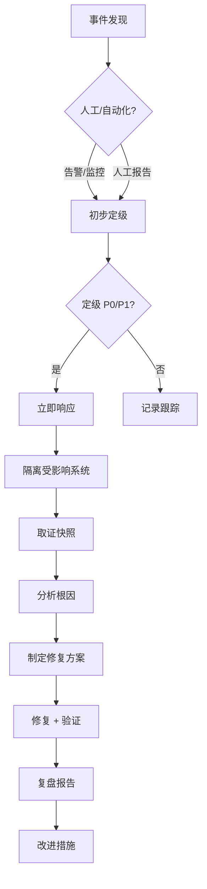

# 安全运维指南

> 适用场景：Linux / Windows 服务器运维、容器化环境、云原生基础设施
> 更新日期：2026-06-03

---

## 目录

1. [安全运维总则](#1-安全运维总则)
2. [系统安全加固](#2-系统安全加固)
3. [网络安全防护](#3-网络安全防护)
4. [身份与访问管理](#4-身份与访问管理)
5. [日志与监控](#5-日志与监控)
6. [漏洞管理](#6-漏洞管理)
7. [数据安全](#7-数据安全)
8. [容器与 Kubernetes 安全](#8-容器与-kubernetes-安全)
9. [应急响应](#9-应急响应)
10. [合规与审计](#10-合规与审计)
11. [自动化安全运维](#11-自动化安全运维)
12. [附录：常用命令速查](#12-附录常用命令速查)

---

## 1. 安全运维总则

### 1.1 核心原则

| 原则 | 说明 |
|------|------|
| **最小权限** | 用户、进程、服务仅授予完成任务所需的最小权限 |
| **纵深防御** | 多层防护——边界、主机、应用、数据各层独立设防 |
| **默认安全** | 新系统/服务默认关闭不必要的端口、服务、权限 |
| **可审计性** | 所有操作留痕，谁在何时做了什么必须可追溯 |
| **变更管理** | 任何配置变更、版本升级、防火墙规则修改需走审批流程 |

### 1.2 运维纪律

- **禁止** 在正式环境使用 root / Administrator 直连操作
- **禁止** 将密码、密钥、Token 硬编码在脚本或配置文件中
- **禁止** 未经审批开放高危端口（22、3389、3306、6379 等）到公网
- **必须** 所有远程操作通过跳板机（Bastion Host）或 VPN 接入
- **必须** 操作前备份配置文件，操作后验证服务状态
- **必须** 每月至少一次账号权限复核

---

## 2. 系统安全加固

### 2.1 Linux 系统加固

#### 2.1.1 SSH 安全配置 (`/etc/ssh/sshd_config`)

```bash
# 禁止 root 直接登录
PermitRootLogin no

# 使用密钥认证，禁用密码认证
PasswordAuthentication no
PubkeyAuthentication yes
ChallengeResponseAuthentication no

# 仅允许特定用户组登录
AllowGroups ssh-users

# 修改默认端口（可选）
Port 32222

# 限制登录尝试次数
MaxAuthTries 3
MaxSessions 10

# 空闲超时断开
ClientAliveInterval 300
ClientAliveCountMax 2

# 使用 SSH Protocol 2
Protocol 2
```

#### 2.1.2 系统内核参数加固 (`/etc/sysctl.d/99-hardening.conf`)

```bash
# 禁止 IP 转发（非路由服务器）
net.ipv4.ip_forward = 0
net.ipv6.conf.all.forwarding = 0

# 防 SYN Flood 攻击
net.ipv4.tcp_syncookies = 1
net.ipv4.tcp_syn_retries = 2
net.ipv4.tcp_synack_retries = 2

# 忽略 ICMP 重定向
net.ipv4.conf.all.accept_redirects = 0
net.ipv4.conf.all.secure_redirects = 0

# 开启反向路径过滤（防 IP 欺骗）
net.ipv4.conf.all.rp_filter = 1

# 记录 SPOOFED 数据包、源路由、重定向
net.ipv4.conf.all.log_martians = 1

# 禁止接收源路由包
net.ipv6.conf.all.accept_source_route = 0
net.ipv4.conf.all.accept_source_route = 0
```

#### 2.1.3 用户与权限管理

```bash
# 创建普通运维用户
useradd -m -s /bin/bash -G ssh-users opsadmin
passwd opsadmin

# 配置 sudo 最小权限（visudo）
# 仅允许特定命令
opsadmin ALL=(ALL) /usr/bin/systemctl, /usr/bin/journalctl, /usr/bin/less /var/log/*

# 查找 SUID/SGID 文件（定期审计）
find / -perm /6000 -type f 2>/dev/null

# 检查空密码账户
awk -F: '($2 == "")' /etc/shadow
```

#### 2.1.4 文件系统保护

```bash
# 关键文件加不可变属性
chattr +i /etc/passwd /etc/shadow /etc/group /etc/gshadow
chattr +i /etc/ssh/sshd_config
chattr +i /etc/sudoers

# 对 /tmp 设置 noexec,nosuid
# 编辑 /etc/fstab
# tmpfs /tmp tmpfs defaults,noexec,nosuid,nodev,size=2G 0 0
```

### 2.2 Windows 系统加固

#### 2.2.1 安全策略（通过 GPO 或 `secpol.msc`）

| 策略 | 推荐值 |
|------|--------|
| 密码长度最小值 | 14 字符 |
| 密码最长使用期限 | 90 天 |
| 账户锁定阈值 | 5 次失败锁定 |
| 账户锁定时间 | 30 分钟 |
| 管理员账户重命名 | 是 |
| 来宾账户 | 禁用 |

#### 2.2.2 服务与功能精简

```powershell
# 关闭不必要的 Windows 功能
Disable-WindowsOptionalFeature -Online -FeatureName "IIS-WebServerRole" -All
Disable-WindowsOptionalFeature -Online -FeatureName "SMB1Protocol"

# 检查并禁用高风险服务
Set-Service -Name RemoteRegistry -StartupType Disabled
Set-Service -Name RemoteAccess -StartupType Disabled
```

#### 2.2.3 Windows Defender / 安全中心

```powershell
# 启用实时保护
Set-MpPreference -DisableRealtimeMonitoring $false
Set-MpPreference -PUAProtection Enabled

# 配置云保护
Set-MpPreference -CloudServiceEnabled $true
Set-MpPreference -CloudBlockLevel High
```

---

## 3. 网络安全防护

### 3.1 防火墙规则（iptables / nftables 示例）

```bash
# 默认丢弃入站流量
iptables -P INPUT DROP
iptables -P FORWARD DROP
iptables -P OUTPUT ACCEPT

# 允许回环接口
iptables -A INPUT -i lo -j ACCEPT

# 允许已建立的连接
iptables -A INPUT -m state --state ESTABLISHED,RELATED -j ACCEPT

# 允许 SSH（指定来源 IP）
iptables -A INPUT -p tcp --dport 32222 -s 10.0.0.0/8 -j ACCEPT

# 允许 HTTP/HTTPS（公网服务）
iptables -A INPUT -p tcp --dport 80 -j ACCEPT
iptables -A INPUT -p tcp --dport 443 -j ACCEPT

# 限制 ICMP（防 ping flood）
iptables -A INPUT -p icmp --icmp-type echo-request -m limit --limit 1/second -j ACCEPT
iptables -A INPUT -p icmp --icmp-type echo-request -j DROP

# 防端口扫描
iptables -A INPUT -p tcp --tcp-flags ALL NONE -j DROP
iptables -A INPUT -p tcp --tcp-flags ALL ALL -j DROP

# 保存规则
iptables-save > /etc/iptables/rules.v4
```

### 3.2 跳板机（Bastion）架构

```
                          ┌─────────────────┐
                          │  运维人员终端    │
                          └────────┬────────┘
                                   │ SSH (密钥)
                                   ▼
                          ┌─────────────────┐
                          │   跳板机        │
                          │   Bastion Host  │
                          │   审计日志      │
                          └────────┬────────┘
                                   │ SSH (转发)
                                   ▼
                    ┌──────────────┼──────────────┐
                    │              │              │
                    ▼              ▼              ▼
              ┌──────────┐  ┌──────────┐  ┌──────────┐
              │  Web 服务器 │  │  DB 服务器 │  │ 应用服务器 │
              └──────────┘  └──────────┘  └──────────┘
```

- 跳板机必须**双因素认证**
- 记录所有操作日志(SSH session logging)
- 跳板机本身不存储业务数据

### 3.3 WAF / 反向代理层

```nginx
# Nginx 反代 + 基础 WAF 规则（/etc/nginx/conf.d/waf.conf）

# 限制请求速率
limit_req_zone $binary_remote_addr zone=api:10m rate=30r/s;

location / {
    limit_req zone=api burst=50 nodelay;

    # 屏蔽常见扫描路径
    if ($request_uri ~* "(wp-admin|phpmyadmin|\.env|\.git)") {
        return 403;
    }

    # 限制请求体大小
    client_max_body_size 10M;

    # 屏蔽恶意 User-Agent
    if ($http_user_agent ~* (sqlmap|nikto|nmap|masscan|zgrab)) {
        return 403;
    }
}
```

---

## 4. 身份与访问管理

### 4.1 认证策略

| 项目 | 要求 |
|------|------|
| 密码复杂度 | 大写 + 小写 + 数字 + 特殊字符，≥ 14 位 |
| MFA | 所有远程登录、管理面板必须启用 |
| SSH 密钥 | 使用 ed25519，禁止使用 RSA 1024 以下 |
| 服务账号密码 | 自动轮换，每 90 天 |
| API Token | 设置过期时间，禁止永久 Token |

### 4.2 密钥管理

```bash
# SSH 密钥生成规范
ssh-keygen -t ed25519 -a 100 -f ~/.ssh/id_ed25519 -C "opsadmin@company-202606"

# 禁止使用无密码密钥
# 检查：
ssh-keygen -l -f ~/.ssh/id_ed25519

# 密钥分发时机：仅入职/权限变更时通过安全通道分发
```

### 4.3 权限审计脚本（Linux）

```bash
#!/bin/bash
# audit_permissions.sh - 每周运行

echo "=== SUID/SGID 文件 ==="
find / -type f \( -perm -4000 -o -perm -2000 \) 2>/dev/null

echo "=== 空密码用户 ==="
awk -F: '($2 == "" || $2 == "!") {print $1}' /etc/shadow

echo "=== sudoers 中的用户 ==="
grep -v '^#' /etc/sudoers | grep -v '^$'

echo "=== 近期登录记录 ==="
last -10

echo "=== 当前在线用户 ==="
who

echo "=== SSH 公钥列表 ==="
for user in $(ls /home/); do
    echo "$user:"
    cat /home/$user/.ssh/authorized_keys 2>/dev/null | awk '{print $3}'
done
```

---

## 5. 日志与监控

### 5.1 需要收集的日志

| 日志类型 | 来源 | 保留期限 |
|----------|------|----------|
| 系统日志 | `/var/log/messages`, `journald` | 180 天 |
| 认证日志 | `/var/log/secure`, Windows Security Event | 365 天 |
| 应用日志 | Nginx, Tomcat, 业务日志 | 90 天 |
| 数据库日志 | MySQL slow log, PostgreSQL pg_log | 30 天 |
| 网络日志 | iptables log, firewall log | 90 天 |
| 审计日志 | auditd, Windows Audit Policy | 365 天 |

### 5.2 auditd 配置示例

```bash
# /etc/audit/rules.d/hardening.rules

# 监控关键文件变更
-w /etc/passwd -p wa -k identity
-w /etc/shadow -p wa -k identity
-w /etc/ssh/sshd_config -p wa -k sshd_config
-w /etc/sudoers -p wa -k sudoers

# 监控权限提升
-a always,exit -S execve -F uid=0 -k privilege_escalation

# 监控网络配置变更
-w /etc/sysconfig/network -p wa -k network_config
-w /etc/hosts -p wa -k hosts_file

# 监控内核模块加载
-w /sbin/insmod -p x -k kernel_module
-w /sbin/modprobe -p x -k kernel_module
```

### 5.3 日志集中管理（ELK / Loki）

```yaml
# FileBeat 配置要点（/etc/filebeat/filebeat.yml）
filebeat.inputs:
  - type: log
    paths:
      - /var/log/*.log
      - /var/log/nginx/*.log
    fields:
      env: production
      server: web-01

  - type: log
    paths:
      - /var/log/secure
    fields:
      category: auth

output.elasticsearch:
  hosts: ["https://elastic.internal:9200"]
  username: "filebeat"
  password: "${ES_PASSWORD}"
  ssl.verification_mode: certificate
```

### 5.4 关键告警规则

| 规则 | 阈值 | 响应 |
|------|------|------|
| SSH 认证失败 | 5 次/分钟 | 封锁 IP + 告警 |
| CPU 异常 | > 95% 持续 10 分钟 | 查挖矿/异常进程 |
| 磁盘 IO 异常 | await > 100ms | 检查磁盘健康 |
| 出站流量突增 | > 10x 基线 | 查数据泄露 |
| 新增监听端口 | 新端口上线 | 查后门/新服务 |

---

## 6. 漏洞管理

### 6.1 漏洞管理生命周期

```
发现 ──→ 评估 ──→ 优先级 ──→ 修复 ──→ 验证 ──→ 关闭
  ↑                                            │
  └────────────────────────────────────────────┘
              （持续循环）
```

### 6.2 修复优先级矩阵

| 紧急度 | CVSS 评分 | 修复 SLA |
|--------|-----------|----------|
| 紧急 (Critical) | 9.0 - 10.0 | 24 小时内 |
| 高危 (High) | 7.0 - 8.9 | 7 天内 |
| 中危 (Medium) | 4.0 - 6.9 | 30 天内 |
| 低危 (Low) | 0.1 - 3.9 | 下个维护窗口 |

### 6.3 常用扫描命令

```bash
# 系统漏洞扫描
# 安装绿盟/OpenVAS/Nessus 客户端
# 使用 lynis 做基线检查
lynis audit system

# 检查已知漏洞的包
# Debian/Ubuntu
apt-listbugs --all
# CentOS/RHEL
yum updateinfo list security all

# 容器镜像漏洞扫描
trivy image nginx:latest
trivy repo https://github.com/example/project

# Web 应用扫描（OWASP ZAP 命令行）
zap-cli quick-scan --self-contained --start-options '-config api.disablekey=true' http://target.com
```

### 6.4 补丁管理策略

- 测试环境优先：测试环境 → 预发布 → 生产（灰度 10% → 50% → 100%）
- 内核补丁：使用 `livepatch`/`kpatch` 热修复，非紧急不重启
- 容器补丁：重新构建镜像，滚动更新
- 数据库补丁：主从切换后打补丁，再切换回来

---

## 7. 数据安全

### 7.1 数据分类

| 级别 | 定义 | 示例 | 要求 |
|------|------|------|------|
| L4 绝密 | 核心商业机密 | 用户密码明文、支付密钥 | 加密存储 + 不可外网传输 + 专人审计 |
| L3 机密 | 敏感业务数据 | 用户手机号、身份证、数据库全量 | 传输/存储加密 + 脱敏展示 |
| L2 内部 | 内部运营数据 | 系统日志、监控指标 | 内部访问控制 |
| L1 公开 | 可对外信息 | 官网文档、API 文档 | 无需特殊保护 |

### 7.2 加密要求

```bash
# 数据传输：TLS 1.2+
openssl s_client -connect example.com:443 -tls1_2

# 磁盘加密（LUKS 示例）
cryptsetup luksFormat /dev/sdb1
cryptsetup open /dev/sdb1 encrypted_data
mkfs.ext4 /dev/mapper/encrypted_data

# 数据库列级加密（MySQL 示例）
CREATE TABLE users (
    id INT PRIMARY KEY,
    name VARCHAR(100),
    phone_enc VARBINARY(256),              -- AES 加密存储
    ssn_enc VARBINARY(256),
    created_at TIMESTAMP
);

INSERT INTO users (id, name, phone_enc, ssn_enc)
VALUES (1, '张三',
    AES_ENCRYPT('13800138000', '${enc_key}'),
    AES_ENCRYPT('110101199001010011', '${enc_key}')
);
```

### 7.3 备份策略

| 备份类型 | 频率 | 保留策略 | 存储位置 |
|----------|------|----------|----------|
| 全量备份 | 每周 | 保留 4 周 | 本地 + 异地 |
| 增量备份 | 每日 | 保留 7 天 | 本地 |
| 事务日志 | 每 30 分钟 | 保留 48 小时 | 本地 |
| 异地备份 | 每日 | 保留 90 天 | 异地对象存储 |

```bash
# 3-2-1 备份原则：
# 3 份副本、2 种介质、1 份异地

# 验证备份可用性（每月一次）
# 在隔离环境恢复备份，校验数据完整性
pg_restore --test /backup/db_20260601.dump
```

---

## 8. 容器与 Kubernetes 安全

### 8.1 容器镜像安全

```dockerfile
# Dockerfile 安全实践

# 1. 使用官方最小基础镜像
FROM alpine:3.20 AS build

# 2. 使用多阶段构建，运行时镜像不含编译工具
FROM alpine:3.20 AS runtime

# 3. 不使用 root 运行
RUN addgroup -S appgroup && adduser -S appuser -G appgroup
USER appuser

# 4. 避免安装不必要的包
# 5. 固定版本标签，不用 latest
# 6. 运行前做镜像扫描
```

```bash
# .trivyignore 忽略误报
# CVE-2023-XXXXX - 影响已修复的上游包

# 在 CI 中集成镜像扫描
trivy image --severity CRITICAL,HIGH --exit-code 1 myapp:${CI_COMMIT_TAG}
```

### 8.2 Kubernetes 安全配置

```yaml
# Pod Security Admission（K8s 1.23+）
# 为命名空间设置安全策略
apiVersion: v1
kind: Namespace
metadata:
  name: production
  labels:
    pod-security.kubernetes.io/enforce: restricted
    pod-security.kubernetes.io/audit: restricted
    pod-security.kubernetes.io/warn: restricted
```

```yaml
# 安全上下文示例
apiVersion: apps/v1
kind: Deployment
metadata:
  name: secure-app
spec:
  template:
    spec:
      securityContext:
        runAsNonRoot: true
        runAsUser: 1001
        fsGroup: 1001
        seccompProfile:
          type: RuntimeDefault
      containers:
      - name: app
        securityContext:
          allowPrivilegeEscalation: false
          readOnlyRootFilesystem: true
          capabilities:
            drop: ["ALL"]
          privileged: false
```

### 8.3 网络策略

```yaml
# 默认拒绝所有入口流量
apiVersion: networking.k8s.io/v1
kind: NetworkPolicy
metadata:
  name: default-deny-ingress
  namespace: production
spec:
  podSelector: {}
  policyTypes:
  - Ingress
```

```yaml
# 允许特定 Pod 之间通信
apiVersion: networking.k8s.io/v1
kind: NetworkPolicy
metadata:
  name: app-db-allow
  namespace: production
spec:
  podSelector:
    matchLabels:
      app: backend
  ingress:
  - from:
    - podSelector:
        matchLabels:
          app: frontend
    ports:
    - protocol: TCP
      port: 8080
```

### 8.4 运行时安全（Falco 规则示例）

```yaml
# 检测容器内 shell 执行
- rule: Terminal shell in container
  desc: A shell was spawned in a container
  condition: >
    spawned_process and container
    and shell_procs
    and not user_shell_container_exclusions
  output: >
    Shell spawned in container
    (user=%user.name container_id=%container.id shell=%proc.name)
  priority: WARNING
  tags: [container, shell]

# 检测敏感路径挂载
- rule: Sensitive mount detected
  desc: Sensitive host path mounted in container
  condition: sensitive_mount and container
  priority: CRITICAL
  output: >
    Sensitive path mounted in container
    (mount=%mount.target container=%container.id)
```

---

## 9. 应急响应

### 9.1 事件分级

| 级别 | 描述 | 示例 | 响应团队 |
|------|------|------|----------|
| P0 严重 | 核心业务中断 / 数据泄露 | DDoS 击垮业务、数据库被删 | 全团队 |
| P1 高危 | 部分功能受损 / 权限绕过 | WebShell、敏感文件泄露 | 安全组 + 运维 |
| P2 中危 | 可疑行为 / 扫描探测 | 端口扫描、暴力破解 | 运维值班 |
| P3 低危 | 告警误报 / 配置异常 | 防火墙规则失效 | 次日处理 |

### 9.2 应急响应流程



### 9.3 常见安全事件处置

#### 9.3.1 发现 Webshell

```bash
# 1. 立即隔离
iptables -A INPUT -s <可疑IP> -j DROP
# 或从外部防火墙封锁

# 2. 查找 Webshell
grep -r "eval(\$_POST" /var/www/html/
grep -r "system(\$_GET" /var/www/html/
find /var/www/html -name "*.php" -newer /var/www/html/index.php -mtime -7

# 3. 检查进程和网络连接
netstat -antp | grep ESTABLISHED
ps aux | grep -v "^\["

# 4. 保留现场
cp /var/log/nginx/access.log /forensics/nginx_access_$(date +%s).log

# 5. 轮换所有密码和密钥
```

#### 9.3.2 发现挖矿程序

```bash
# 1. 降 CPU 优先级/暂停进程
kill -STOP <PID>

# 2. 查找恶意进程来源
ls -la /proc/<PID>/exe
cat /proc/<PID>/cmdline
systemctl list-units --state=running | grep -i crypto

# 3. 检查计划任务
crontab -l
cat /etc/crontab
ls -la /etc/cron.*

# 4. 清理持久化
chkconfig --list | grep -i crypto  # CentOS
systemctl list-unit-files | grep -i crypto

# 5. 全面扫描系统
rkhunter --check
chkrootkit
clamscan -r /
```

#### 9.3.3 数据泄露响应

```
1. 立即切断：封锁出站端口、关闭服务/实例（必要时）
2. 保留证据：快照磁盘、导出日志
3. 通知合规：通知数据保护官/法务
4. 评估影响：确定泄露数据类型和范围
5. 通知相关方：客户、监管机构（GDPR 72 小时内）
6. 修复漏洞：排查根因，修复后恢复服务
7. 事后复盘：形成报告，改进防护
```

### 9.4 应急响应工具箱

```bash
# 取证类
dd if=/dev/sda of=/forensics/disk.img bs=4M         # 磁盘镜像
tcpdump -i eth0 -w /forensics/capture.pcap           # 网络抓包
lsof -p <PID>                                        # 进程文件句柄

# 分析类
stat <file>                                           # 文件元数据
md5sum <file>                                         # 文件哈希
strings <binary> | grep -i "http\|key\|password"     # 二进制分析
volatility -f memory.dump imageinfo                   # 内存分析

# 清理类
# 仅确认无害后再清理，否则先保留现场
rm -f <malware_path>
systemctl disable <malicious_service>
```

---

## 10. 合规与审计

### 10.1 常见合规标准

| 标准 | 适用场景 | 核心要求 |
|------|----------|----------|
| **等保 2.0** | 中国境内信息系统 | 安全管理制度、访问控制、数据备份 |
| **GDPR** | 涉及欧盟用户数据 | 数据保护、用户同意、泄露通知 |
| **ISO 27001** | 信息安全管理体系 | PDCA 持续改进、风险评估 |
| **PCI DSS** | 信用卡数据处理 | 加密、访问控制、定期扫描 |
| **SOC 2** | SaaS 服务商 | 安全、可用性、保密性 |

### 10.2 审计日志保留

```bash
# /etc/logrotate.d/secure 配置示例
/var/log/secure
/var/log/messages
/var/log/audit/audit.log
{
    daily
    rotate 365
    compress
    delaycompress
    missingok
    notifempty
    create 0600 root root
    sharedscripts
    postrotate
        /usr/bin/systemctl reload rsyslog > /dev/null 2>&1 || true
    endscript
}
```

### 10.3 定期审计清单

| 周期 | 审计项 | 责任人 |
|------|--------|--------|
| 每日 | 检查关键服务运行状态 | 值班运维 |
| 每日 | 查看异常登录告警 | 安全组 |
| 每周 | 审查 sudo 日志 | 运维组长 |
| 每周 | 全量漏洞扫描 | 安全组 |
| 每月 | 账号权限复核 | 人事 + 运维 |
| 每月 | 备份可用性验证 | 运维 |
| 每季度 | 渗透测试 | 第三方 |
| 每半年 | 应急演练 | 全团队 |
| 每年 | 全面安全审计 | 外部审计 |

---

## 11. 自动化安全运维

### 11.1 CI/CD 安全门禁

```yaml
# .gitlab-ci.yml 安全阶段示例
stages:
  - security-scan

sast:
  stage: security-scan
  script:
    - semgrep --config=auto .
    - bandit -r src/

dependency-scan:
  stage: security-scan
  script:
    - safety check -r requirements.txt
    - npm audit --audit-level=high

container-scan:
  stage: security-scan
  script:
    - trivy image --severity CRITICAL --exit-code 1 $CI_REGISTRY_IMAGE:$CI_COMMIT_SHA

iac-scan:
  stage: security-scan
  script:
    - checkov -d terraform/
    - tfsec terraform/
```

### 11.2 常用自动化工具

| 工具 | 用途 | 推荐场景 |
|------|------|----------|
| **Ansible** | 配置管理与合规检查 | 批量服务器加固 |
| **Lynis** | 系统安全审计 | 基线检查 |
| **OpenSCAP** | 合规扫描 | 等保/GDPR 合规 |
| **Trivy** | 容器/依赖漏洞扫描 | CI/CD 集成 |
| **Semgrep** | SAST 代码安全扫描 | 开发阶段 |
| **Checkov** | IaC 安全检查 | Terraform/CloudFormation |
| **Falco** | 容器运行时安全 | K8s 环境 |
| **Wazuh** | SIEM/XDR | 日志集中 + 入侵检测 |

### 11.3 Ansible 合规检查示例

```yaml
---
- name: SSH 安全合规检查
  hosts: all
  tasks:
    - name: 检查 root 远程登录是否禁用
      lineinfile:
        path: /etc/ssh/sshd_config
        regexp: '^PermitRootLogin'
        line: 'PermitRootLogin no'
      check_mode: yes
      register: ssh_check
      ignore_errors: yes

    - name: 报告不合规项
      debug:
        msg: "WARNING: {{ inventory_hostname }} SSH PermitRootLogin not set"
      when: ssh_check.changed

    - name: 检查密码认证是否禁用
      lineinfile:
        path: /etc/ssh/sshd_config
        regexp: '^PasswordAuthentication'
        line: 'PasswordAuthentication no'
      check_mode: yes
      register: pwd_check

    - name: 检查 iptables 默认策略
      shell: iptables -L INPUT --line-numbers | head -5
      register: iptables_output
      changed_when: false
```

---

## 12. 附录：常用命令速查

### 12.1 快速排查命令

```bash
# 网络连接分析
ss -antp                                   # 所有 TCP 连接及进程
ss -tuln                                   # 监听端口
lsof -i :80                                # 谁占用了 80 端口

# 进程分析
ps auxf                                    # 进程树
top -c -b -n 1 | head -30                  # CPU 排序 TOP 30

# 文件分析
find / -type f -mtime -1 -ls               # 昨天变更的文件
find / -type d -perm -2 -ls                # 全局可写目录

# 登录分析
lastb                                      # 登录失败记录
last -f /var/log/wtmp | head -20           # 最近登录
journalctl _COMM=sshd --since "24 hours ago"  # SSH 日志

# 系统信息
uname -a                                   # 内核版本
cat /etc/os-release                        # 发行版信息
uptime                                     # 运行时间 + 负载
dmesg -T | tail -20                        # 内核消息
```

### 12.2 安全配置清单

部署新服务器时的检查清单：

```
□ 系统已更新到最新补丁
□ SSH 已禁用密码登录 + 禁用 root 登录
□ 防火墙已配置默认拒绝 + 仅开放必要端口
□ 已安装并配置 auditd
□ 已配置日志集中发送
□ 所有用户使用密钥登录 + MFA
□ 已安装并配置入侵检测（OSSEC / Wazuh Agent）
□ 容器环境下已配置 Seccomp / AppArmor
□ 数据目录已加密
□ 已配置自动备份并验证
□ 已加入配置管理（Ansible / Salt）
□ 已注册监控（CPU/内存/磁盘/网络基线）
□ 关键文件已加不可变属性
□ 未使用的服务已卸载/禁用
```

### 12.3 参考资源

| 资源 | 链接 |
|------|------|
| CIS Benchmarks | https://www.cisecurity.org/cis-benchmarks |
| OWASP Top 10 | https://owasp.org/www-project-top-ten/ |
| NIST SP 800-53 | https://csrc.nist.gov/publications/detail/sp/800-53/rev-5/final |
| MITRE ATT&CK | https://attack.mitre.org/ |
| 国家网络安全通报中心 | https://www.cert.org.cn/ |

---

> **免责声明**：本文档仅供内部运维参考，具体实施请根据实际环境调整。涉及生产环境的变更操作，请严格遵循变更管理流程。
>
> **文档维护**：建议每月 Review 一次，结合实际攻防案例持续更新。
