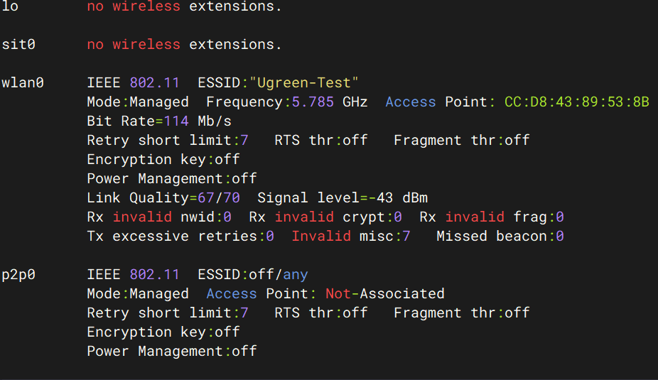

# IPC 文件体系

## IPC 配置定位概述（扩展版）

### 1. 配置文件分类体系

IPC 设备的配置文件按功能维度可分为以下四类：

|分类|作用|典型文件|变更频率|
| :-----| :------------------------------| :---------| :----------------------------|
|**身份凭证类**|存储设备唯一标识、证书、密钥|`ipc_config.dat`|极低（出厂烧录）|
|**网络连接类**|Wi-Fi 认证、IP 分配、协议协商|`wpa_supplicant.conf`|中（用户切换 Wi-Fi 时变更）|
|**业务逻辑类**|设备联动规则、AI 事件触发条件|`devicelist.json`|中（App 配置变更时同步）|
|**系统运行类**|进程控制、日志输出、调试参数|`/opt/bin/ipc`​、`/mnt/debug/*.log`|高（运行时动态生成）|

---

### 2. 核心配置文件定位路径

|文件路径|核心内容|定位方式|备注|
| :---------| :--------------------------------------------------------------| :---------------------| :---------------------------|
|`/mnt/paramfs/config/ipc_config.dat`|设备 SN、MAC、ECC 私钥、设备证书、云平台地址、加密 Wi-Fi 密码|`strings`​ / `hexdump -C`|**最高优先级**，损坏将导致设备无法注册|
|`/mnt/paramfs/config/devicelist.json`|同账号设备列表及场景联动规则（IFTTT 模式）|`cat`​ / `jq`|由云端下发，本地缓存|
|`/tmp/wpa_supplicant.conf`|运行时 Wi-Fi 连接配置（含明文密码或 PSK）|`cat`|由主程序动态生成，重启重置|
|`/etc/wpa_supplicant.conf`|持久化 Wi-Fi 配置模板（若存在）|`cat`​ / `vi`|非所有设备必有|
|`/opt/bin/ipc`|主控程序（含 `ENC1`​ 解密逻辑、`wpa_supplicant` 启动器）|`file`​ / `strings` / 逆向分析|229MB，核心二进制|
|`/mnt/db/local.db`|SQLite 本地数据库（可能存储网络配置、设备状态）|`sqlite3`​ / `strings`|部分设备有此文件|
|`/dev/atbm_ioctl`|Wi-Fi 芯片驱动控制接口|`ls -la`|设备文件，非配置文件|
|`/dev/crypto`|Linux 内核加密 API 接口|`ls -la`|用于解密 `ENC1` 密码|

---

### 3. 配置文件的“生命周期”

```
[出厂烧录] → [首次开机] → [解密] → [动态生成] → [运行加载] → [重启重置]
```

1. **源头**：`ipc_config.dat` 于出厂时写入 Flash，包含设备身份凭证与加密的 Wi-Fi 密码。
2. **解密**：主程序 `/opt/bin/ipc`​ 启动时，读取 `ipc_config.dat`​，通过 `ENC1:` 解密算法还原明文 Wi-Fi 密码。
3. **生成**：解密后，主程序动态生成 `/tmp/wpa_supplicant.conf`，写入明文密码或 PSK 哈希。
4. **启动**：主程序以 `-c /tmp/wpa_supplicant.conf`​ 参数启动 `wpa_supplicant` 进程。
5. **加载**：`wpa_supplicant` 读取配置文件，与路由器完成 4 次握手认证。
6. **动态更新**：通过 `wpa_cli`​ 命令可运行时修改配置（如 `set_network`​、`save_config`）。

---

### 4. 配置定位操作速查

|操作目标|推荐命令|适用场景|
| :--------------------| :------------------------| :---------------------------------|
|查看设备身份|`strings ipc_config.dat|grep -E "SN|
|查看当前 Wi-Fi 配置|`cat /tmp/wpa_supplicant.conf`|获取实际连接的 SSID 及密码形式|
|查看设备联动规则|`cat devicelist.json|jq '.data.devices[].conditions'`|
|追踪配置生成进程|`lsof|grep wpa_supplicant.conf`|
|提取主控程序|`scp root@IP:/opt/bin/ipc ./`|用于离线逆向分析|
|验证配置修改|`wpa_cli -i wlan0 status`|确认新配置是否生效|

---

### 5. 配置文件提取核心命令

|文件类型|提取方法|注意事项|
| :--------------------| :-------------------------| :-----------------------------|
|文本配置（`.conf`​、`.json`）|`cat` 直接查看|使用 `jq` 格式化 JSON 输出|
|二进制配置（`.dat`）|`strings` 提取可读字符|不可直接 `cat`，会导致终端乱码|
|SQLite 数据库（`.db`）|`sqlite3`​ 查询或 `strings`|优先使用 `sqlite3 .tables` 查看表结构|
|二进制程序（`ipc`）|`scp`​ / `sftp` 传输到电脑分析|文件体积大，传输需要稳定网络|

---

### 6. 配置定位常见陷阱与规避

|陷阱|表现|规避方法|
| :-----------------------| :-----------------------| :-----------------------------------------|
|`cat` 二进制文件|终端显示乱码，可能卡死|用 `strings`​ 或 `hexdump -C` 代替|
|直接修改运行中配置文件|修改被进程覆盖|先停止相关进程再修改，或使用 `wpa_cli` 在线修改|
|未备份直接修改|配置损坏无法恢复|修改前执行 `cp file file.bak`|
|忽略文件权限|修改后无法保存|确认用户为 `root` 且有写权限|
|跨网段传输大文件|传输中断或超时|使用 `scp`​ 或 `sftp`​，避免 `nc` 直连|

---

### 7. 配置文件与环境映射关系

|物理组件|对应配置文件|关键字段|配置错误影响|
| :---------------------| :-------------| :---------------| :-----------------------|
|Wi-Fi 芯片（atbm）|`wpa_supplicant.conf`|`ssid`​、`psk`|无法连接 Wi-Fi|
|证书存储（安全元件）|`ipc_config.dat`|ECC 私钥、证书|云端认证失败，设备离线|
|AI 算法引擎|`devicelist.json`|`compareValue`​、`actions`|联动规则不触发|
|云通信模块|`ipc_config.dat`|`api-cn-device.ugreenhome.com`|无法与云端同步|

iwconfig  -a   



### 1.信号强度与链路质量

这是判断当前网络物理层是否健康的“黄金标准”：

- **​`Signal level=-43 dBm`​**​：这是最核心的数值。 **-43 dBm** 属于“极强”信号区间（通常 -50 dBm 以内即为满格）。这意味着网卡到路由器之间基本没有干扰或遮挡，物理传输条件极佳。
- **​`Link Quality=67/70`​**：接近满分的评分（96%），佐证了信号的纯净度。

### 2. 连接认证与配对状态

这是判断是否“连上了正确设备”的依据：

- **​`ESSID:"Ugreen-Test"`​** ：确认您连接的是指定的目标 Wi-Fi，没有被“钓鱼”或错连到隔壁热点。
- **​`Access Point:CC:D8:43:89:53:8B`​**：显示路由器具体的 MAC 地址，表明网卡与路由器已完成硬件级别的握手关联（Authenticated）。

### 3. 电源管理（影响稳定性）

- **​`Power Management:off`​**​：​**这是一个极其重要的友好信号**​。如果此值为 `on`​，Linux 内核可能会为了省电而频繁让网卡休眠，导致网络延迟波动或断流。当前为 `off` 意味着网卡将全速响应，延迟会非常稳定。

### 4. 物理传输速率（影响速度上限）

- **​`Bit Rate=114 Mb/s`​**​：这是当前协商出的实时物理层速率（PHY Rate）。需要说明的是，114 Mb/s 在 5GHz 频段下属于中等偏上水平，虽然未跑满极限（很多高端网卡可达 300Mbps 以上），但这通常受限于路由器当前的频宽设置（如 40MHz），​**不会影响日常浏览和视频，只是在传输大文件时速度上限会受此制约**。

设备出现 大量`ret=-5208`​ 错误，通常指向**设备与云端服务之间的通信或授权问题**

‍

‍
