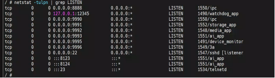
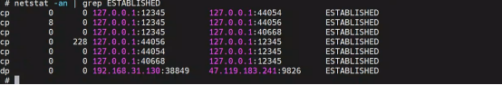
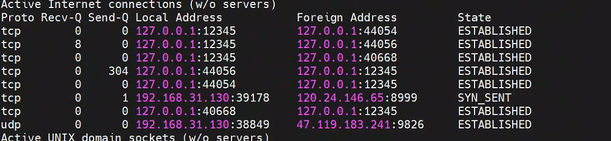

# iot





‍



好，我们把你这两条连接​**重新按“同一套逻辑体系”整理一遍**，避免你现在被 netstat / lsof / UDP / TCP 这些信息混着看。

我直接给你一张“清晰分层图 + 结论”。

---

‍

‍

‍

# 🧠 一、两条连接原始信息

## 🟥 ① TCP 控制连接（8999）

```text
192.168.31.130:37050 → 120.24.146.65:8999
状态：SYN_SENT
进程：未知 / 未稳定绑定
```

---

## 🟦 ② UDP 数据连接（9826）

```text
192.168.31.130:38849 → 47.119.183.241:9826
状态：ESTABLISHED（UDP语义）
进程：/opt/bin/ipc (PID 1550)
```

---

# 🧠 二、统一架构视角（最重要）

这两条其实不是独立的，而是同一套云通信流程的两个阶段：

```text
            ┌──────────────────────┐
            │   120.24.146.65:8999 │
            │   云控制服务器        │
            └─────────┬────────────┘
                      │
        （注册 / 登录 / 获取节点）
                      │
                      ↓
            返回 P2P 节点信息
                      │
                      ↓
┌──────────────────────────────────┐
│ 47.119.183.241:9826             │
│ 云P2P / relay / 心跳通道        │
└──────────────┬──────────────────┘
               │
               ↓
        /opt/bin/ipc (PID 1550)
```

---

# 🧠 三、分别在做什么（核心区别）

## 🟥 8999 \= “控制面（Control Plane）”

### 状态：

- SYN\_SENT（还没成功）

### 作用：

- 设备注册
- 登录云平台
- 获取 P2P 节点（比如 47.119.183.241）

### 特点：

|项目|说明|
| ----------| ---------------|
|协议|TCP|
|生命周期|短|
|是否关键|是入口|
|是否稳定|❌ 当前未建立|

---

## 🟦 9826 \= “数据面（Data Plane）”

### 状态：

- 已建立 UDP 通信

### 作用：

- 设备在线心跳
- NAT 穿透
- P2P / relay 通道
- 手机远程访问基础链路

### 特点：

|项目|说明|
| ----------| --------------|
|协议|UDP|
|生命周期|长连接|
|是否关键|⭐ 核心通道|
|进程|/opt/bin/ipc|

---

# 🧠 四、关键本质区别（非常重要）

## 🟥 8999

> 🔥 “问云端要配置/身份认证”

👉 类似：登录、握手、初始化

---

## 🟦 9826

> 🔥 “真正开始通信的通道”

👉 类似：在线心跳 + P2P通信

---

# 🧠 五、为什么你会觉得混乱？

因为你看到的是：

### netstat：

- 看到连接（SYN\_SENT / UDP）

### lsof：

- 看到进程绑定（ipc）

👉 但它们属于不同阶段：

```text
lsof = 进程视角（谁打开了socket）
netstat = 网络视角（连接到哪里）

时间不一样 + 层级不一样
```

---

# 🧠 六、关键时间顺序（帮你彻底理顺）

```text
① ipc启动
   ↓
② 创建socket（lsof可见）
   ↓
③ TCP连接 120.24.146.65:8999（SYN_SENT）
   ↓
④ 云返回 P2P节点 47.119.183.241:9826
   ↓
⑤ UDP连接建立（netstat ESTABLISHED）
   ↓
⑥ ipc持续心跳/通信
```

---

# 🧠 七、最终一张“结论表”

|项目|8999 TCP|9826 UDP|
| ----------| ---------------| -------------------|
|角色|控制通道|数据通道|
|状态|SYN\_SENT|ESTABLISHED|
|进程归属|不稳定/未绑定|ipc (PID 1550)|
|是否关键|是入口|⭐ 核心通信|
|是否持续|否|是|
|作用|登录/注册|P2P/心跳/远程访问|

---

# 🧠 八、一句话总结（最关键）

> 🟥 8999 是 IPC 设备“向云端申请服务”的入口连接  
> 🟦 9826 是 IPC 设备“真正保持在线并通信”的核心 UDP 通道（由 ipc 进程控制）

---

# 🧭 如果你下一步想继续（建议）

你现在已经进入设备级分析了，下一步最有价值的是：

### 🔍 1. 确认 8999 为什么没建立

（网络问题 or 云拒绝）

### 🔍 2. 抓 UDP 9826 内容（看是不是加密心跳）

```bash
tcpdump -i eth0 udp port 9826
```

### 🔍 3. 判断是否 P2P / relay / MQTT-like 协议

---

如果你愿意，我可以帮你再往下拆一层：

👉 **把 8999 + 9826 + ipc 进程行为，画成“完整 IPC 云通信协议栈（含攻击/防护视角）”**
