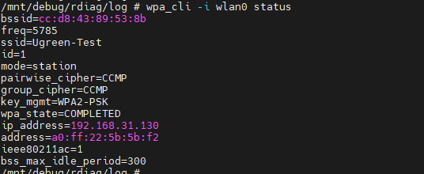
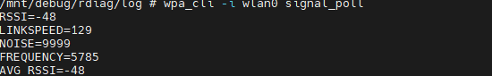
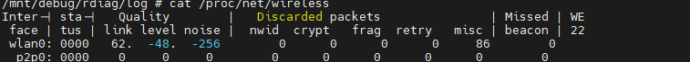
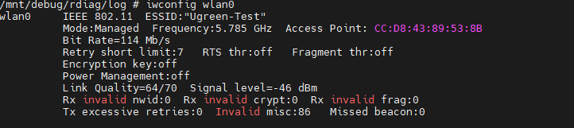

# ipc设备wifi信号问题排查

|指令|作用|关键字段解读|
| ------| ------| ----------------------------------------------------------------------------------------------------------------------------------|
|`wpa_cli -i wlan0 status`|**查看认证状态与IP**|`wpa_state=COMPLETED`​（认证成功）；`ip_address`​（已获取IP）；`ieee80211ac=1`（当前使用11ac模式）。|
|`wpa_cli -i wlan0 signal_poll`|**查看实时物理层参数**|**RSSI**​（信号强度）：​ **\>-65**​（优秀），​ **-65\~-75**​（边缘），​ **\<-75**​（极差，必卡）；​**LINKSPEED**​（协商速率，如果显示 `6.0`​ 或 `1.0` 说明信号极差）。|
|`cat /proc/net/wireless`|**查看丢包与重传统计**|**retry**​（重传次数）：如果该数字在短时间内疯涨，说明干扰严重或兼容性差；​**misc**（杂项错误）：若持续增长，通常指向聚合帧（A-MPDU）超时。|

---

`wpa_cli -i wlan0 status`

`wpa_cli -i wlan0 signal_poll`

`cat /proc/net/wireless`

‍

‍

iwconfig wlan0 

‍

### IPC 无线排障 5 大核心参数

|优先级|关键参数|来源命令|**正常/优秀阈值**|**危险/故障阈值**|对IPC的影响|
| --------| ----------| ----------| --------------------------| ----------------------| --------------------------------------------------------------------------------------|
| **🔴 S级**|**信号强度 (RSSI / Signal Level)**|`wpa_cli signal_poll` `iwconfig wlan0`| **≥ -60 dBm** （满格，贴着路由器）| **≤ -75 dBm** （显示2格以下）|**决定性因素**。低于-75，重传率飙升，视频必卡或断流。|
| **🔴 S级**|**省电模式 (Power Management)**|`iwconfig wlan0`|**必须为**  **​`off`​**|**​`on`​**|**致命的隐性杀手**。如果开省电，芯片会休眠，错过路由器下发的视频帧，导致画面瞬卡（尽管信号满格）。|
| **🟠 A级**|**杂项无效错误 (Invalid misc)**|`iwconfig wlan0`|**停止增长**（或数值很小）|**持续增长**（如你的86次）|**协议兼容性物证**。该值持续增长，代表路由器发来的聚合帧（A-MPDU）被芯片丢弃，信号再好也白搭。|
| **🟠 A级**|**协商速率 (Bit Rate)**|`iwconfig wlan0`|**稳定在较高值**（如 114, 173, 300）|**剧烈跳动**（从300骤降到6）|剧烈跳动说明链路正在反复降速保连接，物理层不稳定。|
| **🟡 B级**|**发射过度重传 (Tx excessive retries)**|`iwconfig wlan0`|**​`0`​**​  **或个位数**|**持续增长至上百**|如果这个值很大，说明**摄像头发出去的数据**路由器没收到，通常意味着**上行干扰**或摄像头功率不足。|

摄像头直接与手机相连，会首先使用 p2p，连接失败会使用云服务器中转
